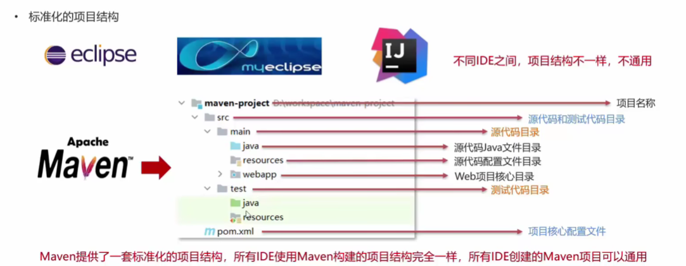
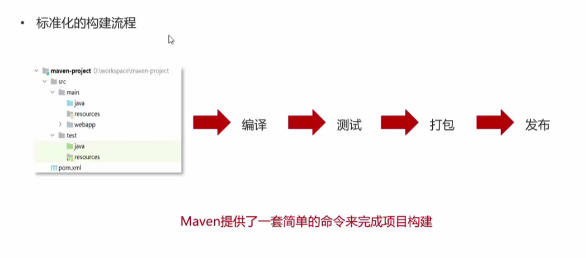
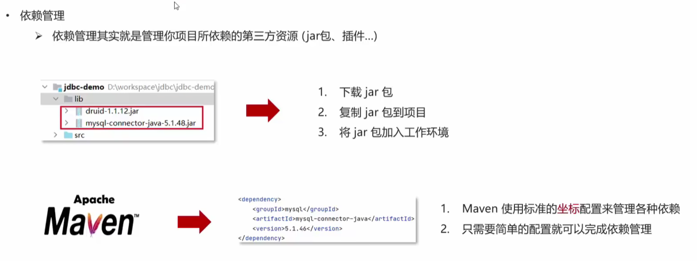
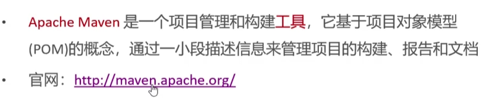

# Maven

Maven 是专门用于管理和构建 java 项目得工具，它的主要功能有：

1. 提供了一套标准化的项目结构
   
2. 提供了一套标准化的构建流程（编译，测试，打包，发布……）
   
3. 提供了一套依赖管理机制
   

## Maven 简介

官网：[http://maven.apache.orp/](http://maven.apache.orp/)

## Maven 安装配置

## Maven 基本使用

## IDEA 配置 Maven

## 依赖管理
