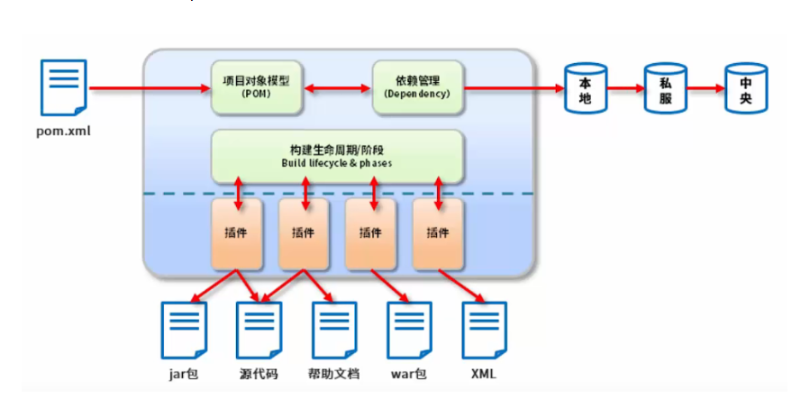
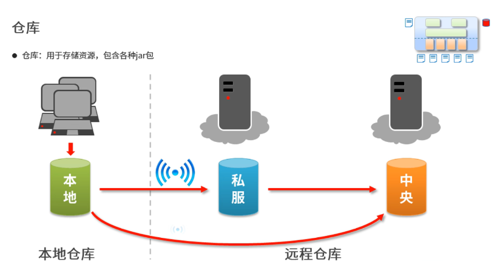
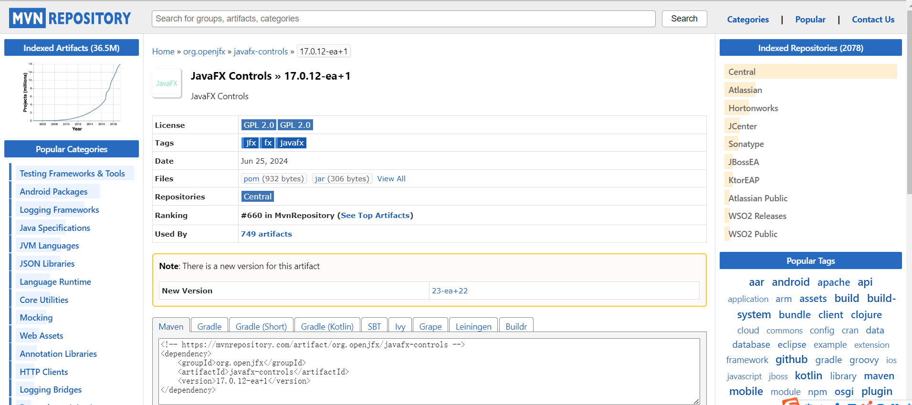

# Maven

## 简介

Maven 的本质是一个项目管理工具，将项目开发和管理过程抽象成一个项目对象模型（Project Object Model，POM）。

## 作用

Maven 是专门用于管理和构建 java 项目得工具，它的主要功能有：

1. 提供了一套标准化的项目结构
   
2. 提供了一套标准化的构建流程（编译，测试，打包，发布……）
   
3. 提供了一套依赖管理机制
   

## 下载与安装

官网：[http://maven.apache.orp/](http://maven.apache.orp/)

## 环境变量配置

在系统变量中配置`MAVEN_HOME`,值为解压目录，然后在`Path`中配置`%MAVEN_HOME%\bin`。

在`cmd`中输入`mvn`命令能够识别，环境变量配置成功。

## 基础概念

### 仓库

私服可以是中央仓库的镜像，解决中央仓库访问慢的问题，也可以存储自己的私有资源，解决版权问题

### 坐标

1. Maven 中的坐标用于描述仓库中 jar 包的位置
    - [https://repo1.maven.org/maven2/](https://repo1.maven.org/maven2/)
    - Maven Repository：[mvnrepository.com](mvnrepository.com)
2. Maven 坐标组成
    - groupId：定义 Maven 项目隶属组织名称 (通常是域名反写，例如：org.mybaatis)
    - artifactId：定义 Maven 项目名称 (通常是模块名称，例如：CRM、SMS)
    - version：定义项目版本号
3. packaging：定义项目的打包方式 (jar/war)

图中 Maven 框中即为`javafx-controls`的 jar 包坐标

maven 坐标的作用：唯一的定位 jar 资源位置，由 maven 工具自动完成识别和下载

# web
