# 编译原理笔记01-绪论


## 1. 什么是编译

编译就是将**高级语言**(源语言)翻译成**汇编语言或机器语言**(目标语言)的过程

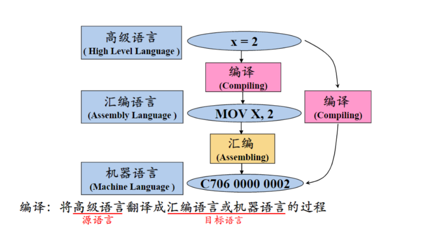

## 2. 编译系统的结构

-   编译系统：
    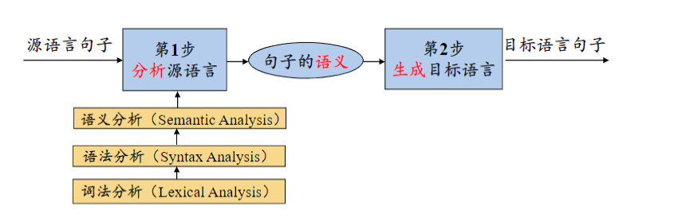

-   编译器：
    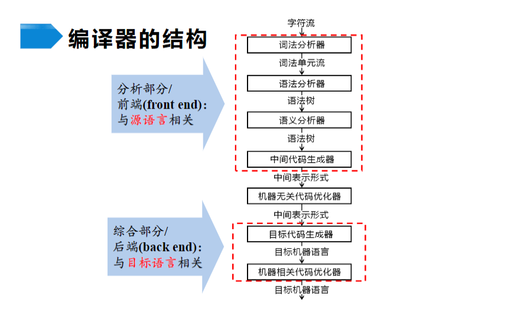

## 3. 词法分析概述

词法分析就是从左到右逐行扫描源语言的字符，识别出各个单词，并将其转换成统一的机内表示--词法单元(**token**)形式

**token:<种别码,属性值>**

-   **种别码**：表示词法单元的类型（例如关键字、标识符、常量等）。
-   **属性值**：提供额外的上下文信息（例如标识符的名称或常量的实际值）。

**示例**

假设你有以下源代码片段：

```C++
int num = 42;
```

词法分析器会将其分解为词法单元，并且每个词法单元的种别码和属性值如下：

-   **"int"**：种别码是 **KEYWORD**，属性值可以是 **"int"**（如果需要）。
-   **"num"**：种别码是 **IDENTIFIER**，属性值是 **"num"**。
-   **"="**：种别码是 **ASSIGNMENT_OPERATOR**，属性值是 **"="**。
-   **"42"**：种别码是 **NUMBER**，属性值是 **"42"**。
-   **";"**：种别码是 **SEMICOLON**，属性值是 **";"**。

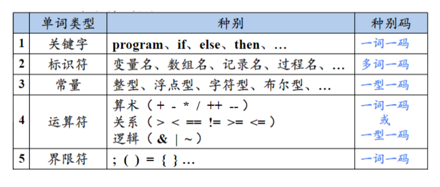

## 4. 语法分析概述

-   语法分析就是从词法分析器输出的 token 序列中识别出各类**短语**，并构造**语法分析树**(parse tree)。
-   语法分析树用来描述句子的**语法结构**。

**示例**

-   赋值语句的语法分析树
    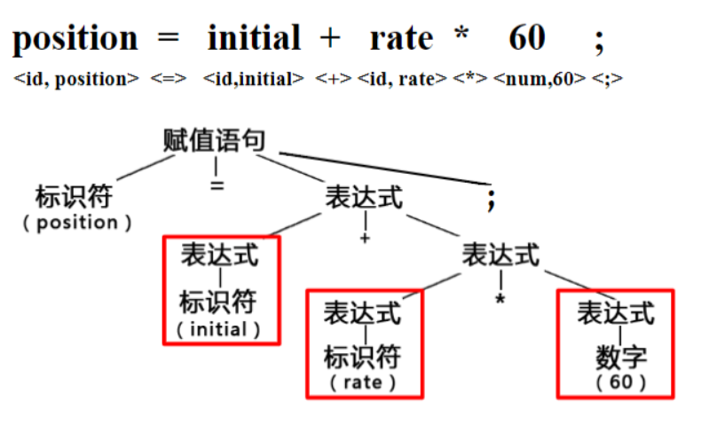
-   变量声明语句的分析树
    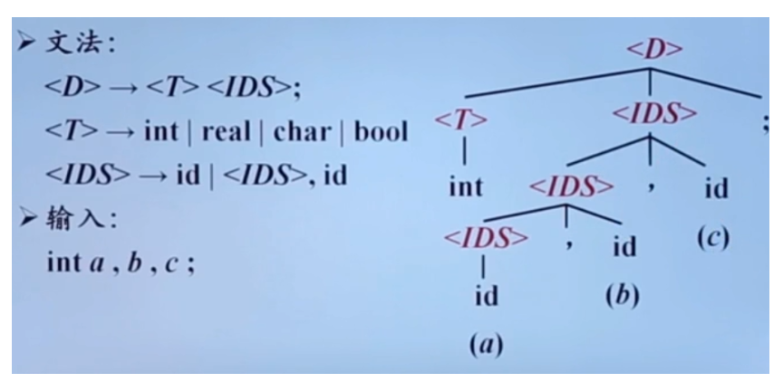

文法：文法就是一系列的规则

-   D：declaration，声明
-   T：type，类型
-   IDS：Identifier sequence，标识符序列

1. 第一条规则：表示一条声明语句是有一个**类型 T**连接一个**标识符 IDS** 和一个**分号**构成的。
2. 第二条规则：表示**类型 T**可以是`int`或`real`或`char`或`bool`。
3. 第三条规则：表示一个**标识符 id**本身可以构成一个**标识符序列**，或者一个**标识符序列**连接一个**逗号**和一个**标识符 id**可以构成一个更大的**标识符序列**。

## 5. 语义分析概述

### 5.1 收集标识符的属性信息

-   高级语言程序中的语句大体可分为两种：**声明语句**和**执行语句**。在声明语句中会声明一些数据对象和过程，并对其分别起一个名字，这些名字也叫**标识符**。
-   对于声明语句来说，语义分析的任务就是收集标识符的**属性信息**。

标识符的属性信息有：
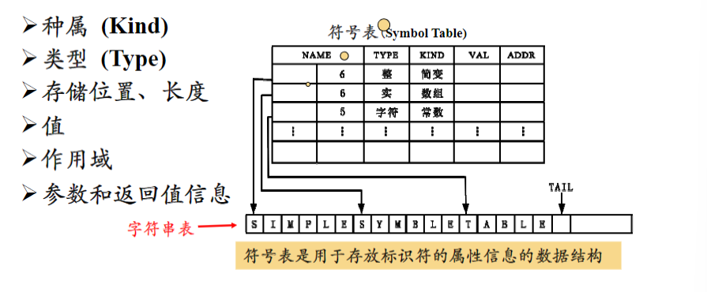

**符号表**

符号表是编译器中用于存储标识符及其属性信息的数据结构。它通常由两部分组成：

1. **符号表的内容**
    - 每个标识符的种属、类型、存储位置、长度等信息。
    - 符号表中的每个条目代表一个标识符及其属性。
2. **字符串表 (String Table)**
    - 字符串表存储程序中使用的标识符名称和字符常数。符号表中的每个标识符条目包含指向字符串表的引用，以标识符在字符串表中的位置和长度。
    - 例如，字符串表可能存储了标识符 x 和 arr，符号表中的条目将指向字符串表中的这些名称。
      语义分析阶段得到的标识符的属性信息存放在符号表中。

### 5.2 语义检查

**常见语义错误：**
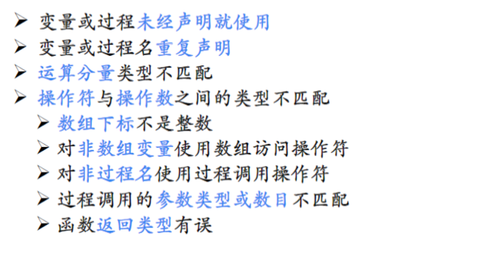

## 6. 中间代码生成

### 6.1 常用的中间表达形式

-   **三地址码：** 三地址码由类似汇编语言的指令序列组成，每个指令最多有三个操作数
-   **语法结构树/语法树**


这里的语法树与前面语法分析的语法树不是一回事。


**常用的三地址指令：**
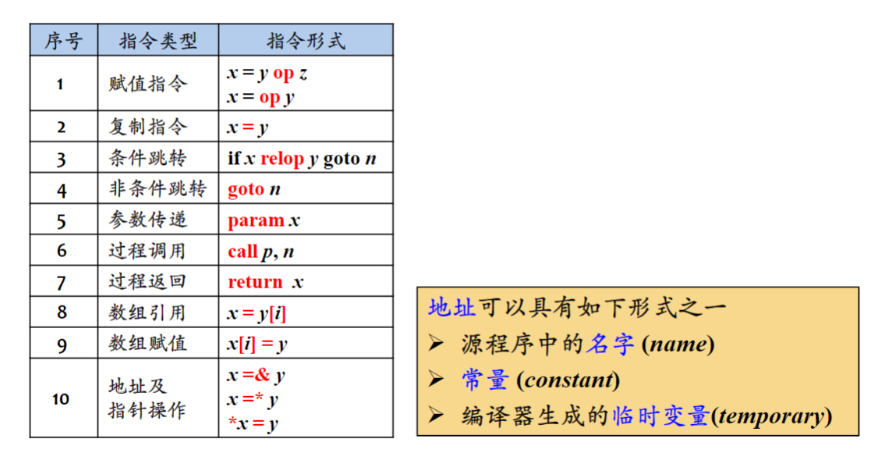

### 6.2 三地址指令的表示

四元式、三元式、间接三元式

**三地址指令的四元式表示：**
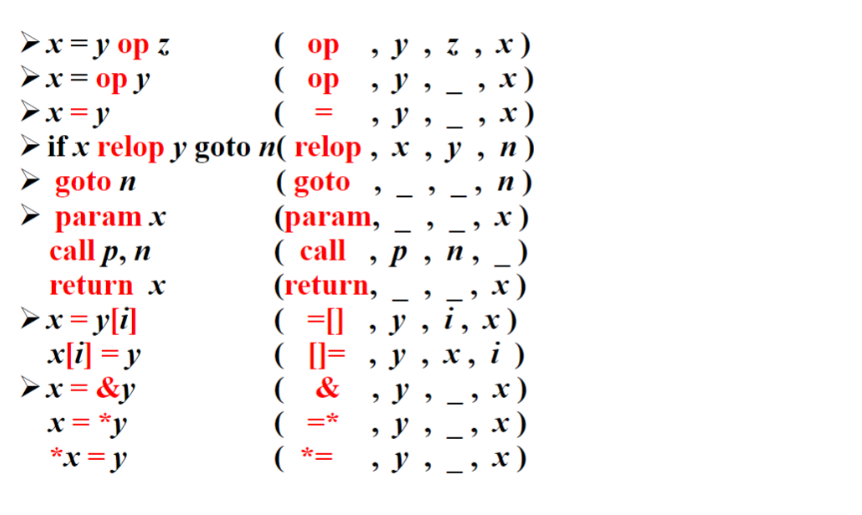

四元式形式中的第一个分量为操作符，第二个和第三个分类为源操作数，第四个分量为目标操作数。

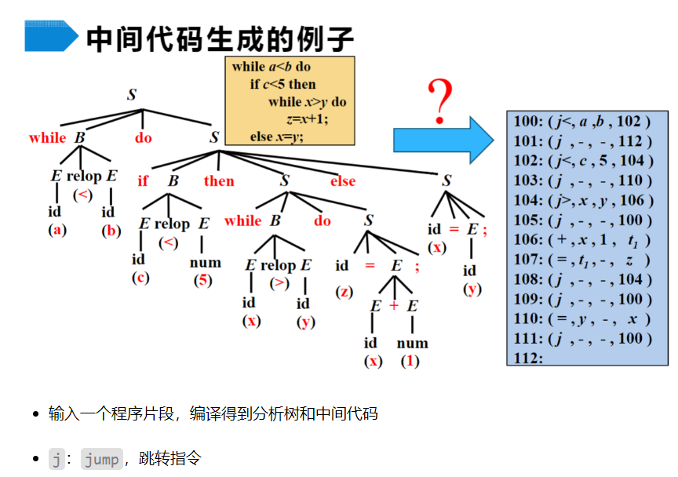

## 7. 目标代码生成

-   目标代码生成就是以源语言的**中间表示形式**作为输出，并把它映射到**目标语言**。
-   目标代码生成的一个重要任务就是为程序中使用的变量合**理分配寄存器**。

## 8. 代码优化

-   代码优化是进行**等价程序变化**，使其**运行更快**，占**用空间更少**。
-   **机器无关代码优化**是在**中间代码**层面优化，**机器相关代码优化**是在**目标代码**层面优化。
-   优化包括识别并删除代码中的重复运算或者冗余运算，将代价较高的运算替换成等价的代价较低的运算等。

## 参考文章

[编译原理笔记 01-绪论](https://wangyi.one/%E7%BC%96%E8%AF%91%E5%8E%9F%E7%90%86%E7%AC%94%E8%AE%B001-%E7%BB%AA%E8%AE%BA/)

