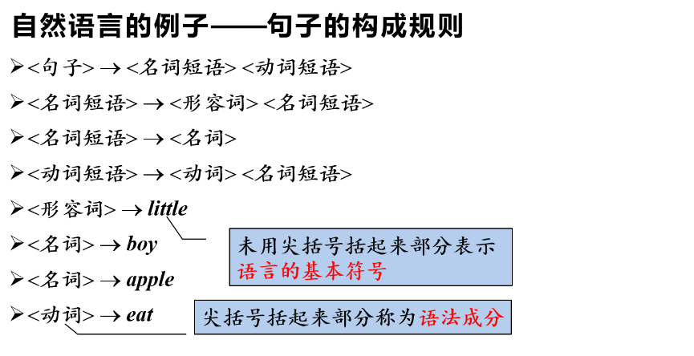
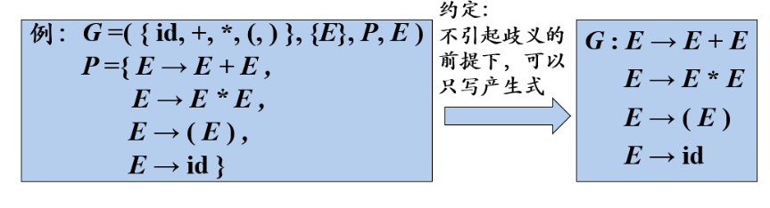
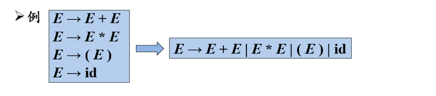
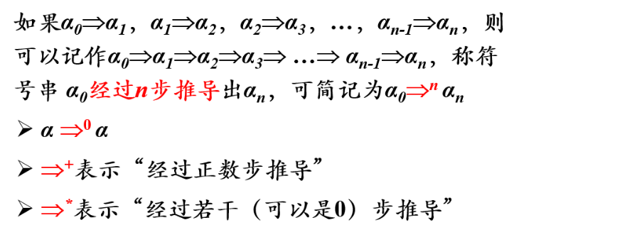
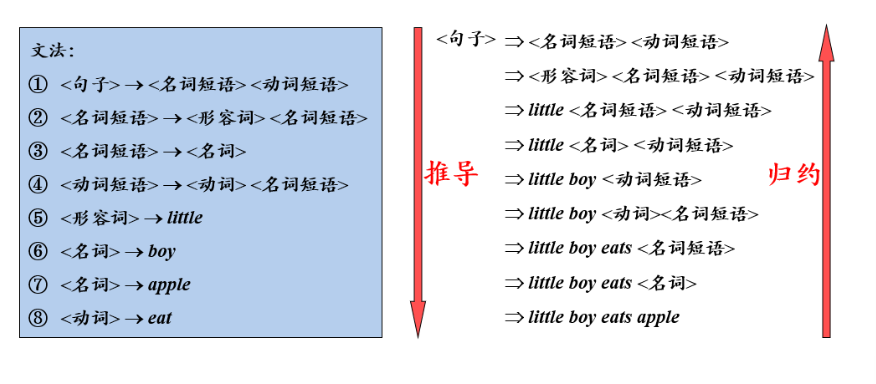
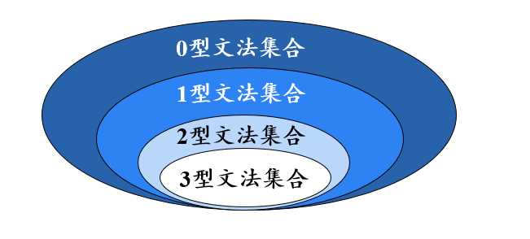
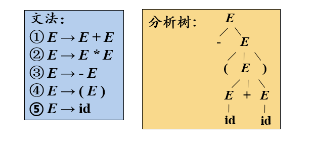
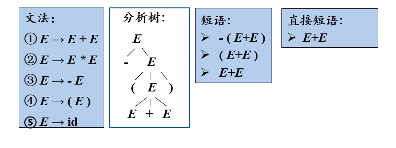
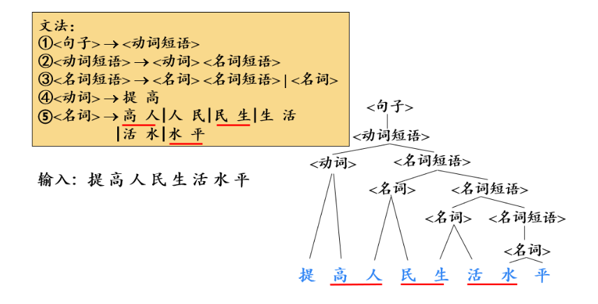
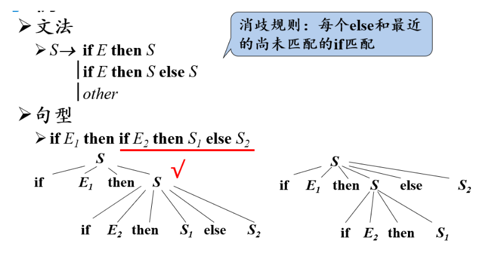

# 编译原理笔记02-程序设计语言及其文法

## 1. 基本概念

### 1.1 字母表

字母表 Σ 是一个**有穷符号集合**

符号：字母、数字、标点符号......

**示例**

-   二进制字母表：{0，1}
-   ASCII 字符集
-   Unicode 字符集 ASCll

### 1.2 字母表上的运算

-   字母表 Σ 相乘 (Σ₁ × Σ₂)

    {0，1} {a，b} = {0a，0b，1a，1b}

-   字母表 Σ 次幂 (Σⁿ)

    {0，1}³ = {0，1} {0，1} {0，1} = {000，001，010，011，100，101，110，111}

-   字母表 Σ 闭包\正闭包 (Σ⁺)

    {a，b，c，d}⁺ = {a，b，c，d，aa，ab，ac，ad，ba，bb，bc，bd，……，aaa，aab，aac，aad，aba，abb，abc，……}

-   字母表 Σ 克林闭包 (Σ\*)

    {a，b，c，d} \* = {ε，a，b，c，d，aa，ab，ac，ad，ba，bb，bc，bd，……，aaa，aab，aac，aad，aba，abb，abc，……}(闭包基础上多了个空串)

**ε：** 空串

### 1.3 串

-   字母表 Σ\* 中的每一个元素都称为是字母表 Σ 上的一个串
-   串**s**的长度记作`|s|`,指串中的符号长度

### 1.4 符号串的头尾

如果 `z=xy` 是一符号串，那么 `x` 是 `z` 的头，`y` 是 `z` 的尾。如果 `x` 是非空的，那么 `y` 是固有尾；若 `y` `非空，x` 是固有头。

以 `m = abc` 为例，它的头是 `ε`，`a`，`ab`，`abc`；它的尾是 `ε`，`c`，`bc`，`abc`。而它的固有头不考虑末尾符号 `c`，固有尾不考虑首部符号 `a`。

### 1.5 串上的运算

-   **连接：** x 和 y 的连接就是把 y 附加到 x 后面形成的串，记作 xy

    1. 【例】若 x=dog，y=house，则 xy=doghouse
    2. **空串 ε**是连接运算的**单位元**，可看做 1 对于任意串，εs=sε=s
    3. 设 x，y，z 是三个字符串，如果 x=yz,则称 y 是 x 的**前缀**，z 是 x 的**后缀**

-   **幂：** 串 s 的 n 次幂就是将 n 个 s 连接起来
    -   【例】若 s=ba，则 s1=ba，s2=baba，s3=bababa，……

## 2. 文法的定义

### 2.1 什么是文法

**文法就是一套语言规则**

-   尖括号括起来的部分称为**语法成分**
-   未用尖括号括起来的部分称为**语言的基本符号**

因为该文法是用来描述句子的构成规则的，所以该文法的基本符号是单词，如果一个文法是用来描述单词的构成规则的，那么该文法的基本符号就是字母。

### 2.2 文法的形式化定义

文法用大写字母 G 表示，把一个文法 G 定义为一个四元组
G=（VT，VN，P，S）

-   VT：终结符集合
    -   **终结符**(terminal symbol)是文法所规定的**语言的基本符号**，有时也称为 **token**
    -   【例】上例中文法用来描述句子的构成规则，所以该文法的**基本符号**是**单词**。VT={apple，boy，eat，little}
-   VN：非终结符集合
    -   **非终结符**(non terminal)是用来表示语法成分的符号，有时也称为“语法变量”。因为可以由它们推导出其他语法成分，所以叫非终结符。
    -   【例】上例中文法的 VN={<句子>，<名词短语>，<动词短语>，<名词>，……}
    -   VT∩VN=Φ，即 VT 和 VN 不相交；VT∪VN=文法符号集，即 VT 并上 VN 构成文法符号集
-   P：产生式集合
    -   **产生式**(production)描述了将终结符和非终结符组成串的方法
    -   产生式的一般形式为 α→β，读作 α 定义为 β
    -   α∈(VT∪VN)⁺，且 α 中至少包含 VN 中的一个元素：称为产生式的**头**或**左部**
    -   β∈(VT∪VN)\*：称为产生式的**体**或**右部**
    -   【例】上例中文法的每一个规则都是一个产生式
-   S：开始符号
    -   S∈VN。开始符号(start symbol)表示的是该文法中**最大的语法成分**
    -   【例】上例中文法的开始符号 S 是句子。S=<句子>

### 2.3 产生式的简写

### 2.4 符号约定

为了避免总是要声明哪些是终结符，哪些是非终结符的麻烦。我们对符号的使用做一些约定。

| 符号       | 约定                                                                                           | 例如                                            |
| ---------- | ---------------------------------------------------------------------------------------------- | ----------------------------------------------- |
| 终结符     | 字母表中排在前面的小写字母；运算符；标点符号；数字；粗体字符串                                 | a，b，c；+，\*；括号、逗号；id、if              |
| 非终结符   | 字母表中排在前面的大写字母；字母 S，通常表示开始符号；小写、斜体的名字；代表程序构造的大写字母 | A，B，C；expr、stmt；E(表达式)、T(项)和 F(因子) |
| 文法符号   | 字母表中排在后面的大写字母                                                                     | X，Y，Z                                         |
| 终结字符串 | 字母表中排在后面的小写字母                                                                     | u，v，……，z                                     |
| 文法符号串 | 小写希腊字母                                                                                   | α，β，γ                                         |

除非特殊说明，否则第一个产生式的左部就是开始符号。即文法中第一个产生式的左部是该文法最大的语法成分。

## 3. 语言的定义

### 3.1 推导与归约

-   给定文法 G=(VT,VN,P,S)，如果 α→β ∈ P，那么可以将符号串 γαδ 中的 α 替换为 β。
-   也就是说，将 γαδ 重写(rewrite)为 γβδ，记作 γαδ ⇒ γβδ。
-   此时，称文法中的符号串 γαδ 直接推导(directly derive)出 γβδ

简而言是，就是用**产生式的右部替换产生式的左部**。

【例】推导与归约

-   从图中可以看出，从<句子>可以推导出`little boy eats apple`,逆过程就叫**归约**。
-   推导就是用**产生式的右部替换产生式的左部**
-   归约就是用**产生式的左部替换产生式的右部**

有了文法，如何判定某一词串是该语言的句子？

-   句子的**推导**--从**生成**语言的角度
-   句子的**归约**--从**识别**句子的角度

### 3.2 语言的形式化定义

-   由文法 G 的开始符号 S 推导出**所有句子构成的集合**称为**文法 G 生成的语言**，记为 L(G)。即，L(G)= {w | S ⇒* w, w∈ VT* }
-   文法解决了无穷语言的有**穷表示**问题。

## 4. 文法的分类

  α → β

根据对文法中产生式的不同要求，可将文法分为**四种类型**

### 4.1 0 型文法(无限制文法/短语结构文法)

-   **无限制文法/短语结构文法**(Phrase Structure Grammar,PSG)
    -   ∀α→β∈P，α 中至少包含一个非终结符
-   **0 型语言**
    -   由 0 型文法 G 生成的语言 L(G)

### 4.2 1 型文法(上下文有关文法)

-   **上下文有关文法**(Context-Sensitive Grammar,CSG)
    -   ∀α→β∈P，∣α∣≤∣β∣,即**产生式左部的符号个数不能多于右部的符号个数**
    -   产生式的一般形式：α1Aα2→α1βα2(β≠ε),即非终结符 A 只有当它的上下文是 α1α2 的时候，才能替换为 β。因此是上下文有关文法。
    -   可以看出，CSG 中产生式右部不能为空串。
-   **上下文无关语言(1 型语言)**
    -   由上下文有关文法(1 型文法)G 生成的语言 L(G)

### 4.3 2 型文法(上下文无关文法)

-   **上下文无关文法**(Context-Free Grammar,CFG)
    -   ∀α→β∈P，α∈VN，即**产生式左部必须是非终结符**
    -   产生式的一般形式：A→β，即将 A 替换为 β 不需要考虑它的上下文。
-   **上下文无关语言(2 型语言)**
    -   由上下文无关文法(2 型文法)G 生成的语言 L(G)

### 4.4 3 型文法(正则文法)

-   **正则文法**(Regular Grammar,RG)
    -   **右线型文法**：A→wB 或 A→w，在 2 型文法的基础上，对产生式右部进行限制，要么是一个终结符串 w，要么是一个终结符串 w 右边加一个非终结符 B
    -   **左线型文法**：A→Bw 或 A→w，在···左部···，左边···；
-   **正则语言(3 型语言)**
    -   由正则语言(3 型文法)G 生成的语言 L(G)
-   **正则文法能描述程序设计的多数单词**

### 4.5 四种文法之间的关系

-   **逐级限制**
    -   0 型文法：α 中至少包含一个非终结符
    -   1 型文法(CSG)：|α|≤|β|
    -   2 型文法(CFG)：α ∈ VN
    -   3 型文法(RG)：A→wB 或 A→w (A→Bw 或 A→w)
-   **逐级包含**

## 5. CFG 的分析树

-   **根节点**的标号为文法开始符号
-   **内部节点**表示对一个产生式 A→β 的应用，该**结点的标号**是此产生式**左部 A**，该**节点的子结点的标号**从左到右构成了产生式的**右部 β**。
-   **叶结点**的标号既可以是**非终结符**，也可以是**终结符**。从左到右排列叶结点得到的符号串称为是这棵树的**产出(yield)**或**边缘(frontier)**。

【例】

分析树是推导的图形化表示

推导过程：E => -E => -(E) => -(E+E) => -(id+id)

### 5.1 句型

-   G[Z],字母表 Σ，如果 z =>\* x，x∈V\*,则称 x 为**句型**
-   G[Z],字母表 Σ，如果 z =>\* x，x∈VT\*,则称 x 为**句子**

### 5.2 最左推导和最右推导

最左（最右）推导：在推导的任何一步 α⇒β，其中 α、β 是句型，都是对 α 中的最左（右）非终结符进行替换

-   最右推导被称为规范推导
-   由规范推导所得到的句型称为规范句型

### 5.2 短语

-   给定一个句型，其分析树中的每一棵**子树的边缘**称为该句型的一个**短语(phrase)**
-   如果子树只有父子两代结点，那么这棵子树的边缘称为该句型的一个**直接短语(直接短语)**
-   最左简单子树的末端结点组成的符号串是**句柄**(只适用于右句型)

【例 1.】短语与直接短语

-   直接短语一定是某产生式的右部
-   但产生式的右部不一定是给定句型的直接短语

【例 2.】

产生式的右部不一定是给定句型的直接短语

### 5.2 二义性文法

如果一个文法可以为某个句子生成多棵分析树，则称这个文法是二义性的。

【例】二义性文法

### 5.3 二义性文法的判定

对于任意一个上下文无关文法，不存在一个算法，判定它是无二义性的，但能给出一组**充分条件**，满足这组充分条件的文法是无二义性的。

-   满足：肯定无二义性
-   不满足：也不一定有二义性

