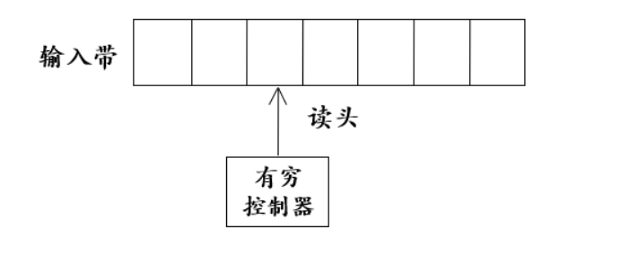
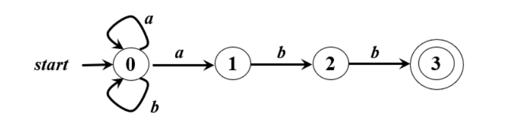
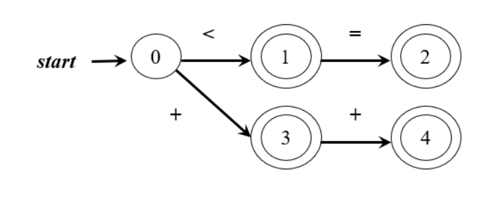
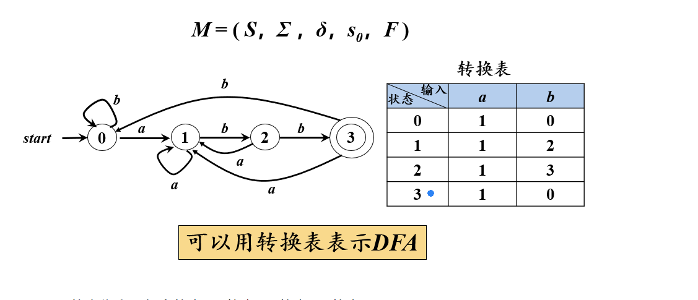
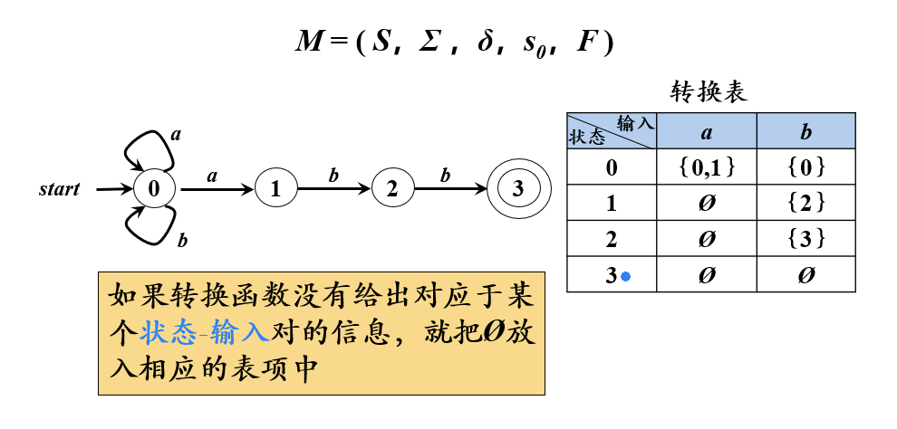
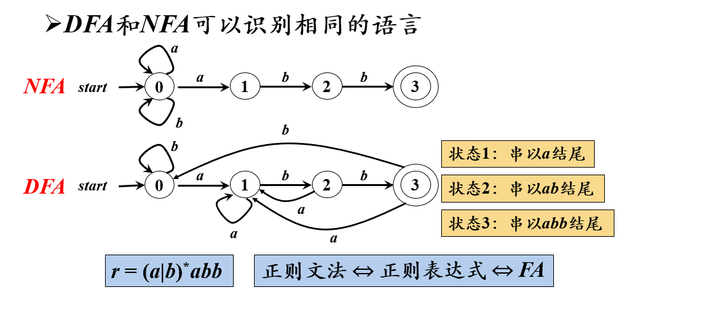
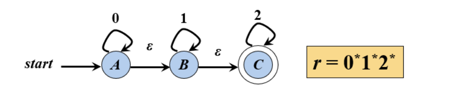
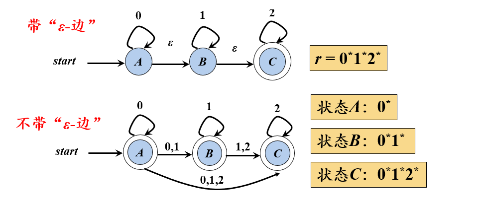
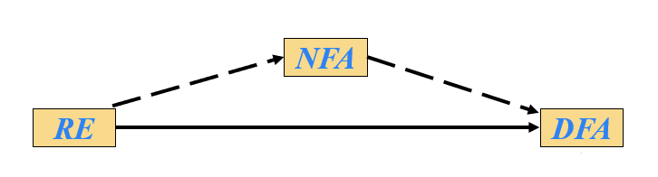

# 编译原理笔记03-词法分析

## 1. 正则表达式

-   **正则表达式(Regular Expression,RE)**是一种用来描述**正则语言**的更紧凑的表示方法。
    -   【例】语言 L={ a } { a , b }\* ( { ε } ∪ ( { . , \_ } { a , b } { a , b }\_ ) )
    -   用正则表达式 r 可以表示为：r=a (a | b)\* ( ε | (.| \_) (a | b) (a | b)\_ )
    -   句子含义是：以 a 开头，连接任意长度的 ab 串，接下来连接一个空串，此时表示句子结束。除此之外，还可以连接一个`.`和`_`,接下来连接一个长度大于等于 1 的 ab 串
    -   `{}*`是克林闭包

正则表达式可以由**较小的正则表达式**按照特定的规则**递归**构建。每个正则表达式 r 定义一个语言，记为 **L(r)**。这个语言也是根据 r 的**子表达式所表示的语言递归定义**的。

### 1.1 正则表达式的定义

1.  ε 是一个 RE，L(ε)={ε}

    -   空串是一个正则表达式，它表示的语言只包含一个空串

2.  如果 a∈∑，则 a 是一个 RE，L(a) = {a}

    -   字母表中任何一个符号都是一个正则表达式。它表示的语言只有它本身

3.  假设 r 和 s 都是 RE，表示的语言分别是 L(r)和 L(s)，则

    -   r|s 是一个 RE，L(r|s)=L(r)∪L(s)
    -   rs 是一个 RE，L(rs)=L(r)L(s)
    -   r\*是一个 RE，L(r\*)=(L(r\*))\*
    -   (r)是一个 RE，L((r))=L(r)

4.  运算的优先级：`*`(克林闭包)、连接、`|`(或运算)

【例】令 Σ = {a，b}，即符号表中包含两个元素 a 和 b，由正则表达式的定义可知 a 是一个正则表达式，b 是一个正则表达式，因此：

-   L(a|b) = L(a)∪L(b) ={a}∪{b} = {a, b}
    -   由于 a 和 b 都是 RE，所以 a|b 还是一个 RE
-   L((a|b)(a|b))=L(a|b)L(a|b)={a,b}{a,b}={aa,ab,ba,bb}
    -   由于 a|b 是 RE，所以 a|b 连接 a|b 还是一个 RE
-   L((a|b)\*)=(L(a|b))\*={a,b}\*= { ε, a, b, aa, ab, ba, bb, aaa, . . .}
    -   a|b 的克林闭包表示任意长度的 ab 串
-   L(a|a\*b) = { a, b, ab, aab, aaab, . . .}
    -   a 或上 a 的克林闭包 b，表示一个 a 或者是若干个 a 后面连接一个 b

【例】用 RE 描述 C 语言中的无符号整数

-   十进制整数的 RE：(1|...|9)(0|...|9)\*|0
    -   表示第一个符号是 1-9 之间的一个数，接下来连接若干个 0-9 之间的数字。除此之外，还可以是整数 0。
-   八进制整数的 RE：0(1|2|3|4|5|6|7)(0|1|2|3|4|5|6|7)\*
    -   表示第一个符号是数字 0，第二个符号是 1-7 之间的一个数字，接下来连接若干个 0-7 之间的数字。
-   十六进制整数的 RE： 0x(1|…|9|a|…|f|A|…|F)(0|…|9|a|…|f|A|…|F )\*
    -   表示第一个符号是 0，第二个符号是 x，第三个符合是 1-F 之间的一个符号，接下来连接若干个 0-F 之间的符号。

### 1.2 RE 的代数定律

| 定律                                                  | 描述                 |
| ----------------------------------------------------- | -------------------- |
| r \| s = s \| r                                       | \| 是可以交换的      |
| r \| ( s \| t ) = ( r \| s ) \| t                     | \| 是可结合的        |
| r ( s t ) = ( r s ) t                                 | 连接是可结合的       |
| r ( s \| t ) = r s \| r t ; ( s \| t ) r = s r \| t r | 连接对 \| 是可分配的 |
| εr=rε=r                                               | ε 是连接的单位元     |
| r* = ( r \| s )*                                      | 克林闭包中一定包含 ε |
| r \*\* = r \*                                         | 克林闭包具有幂等性   |

**正则文法与正则表达式等价**

-   对任何正则文法 G，存在定义同一语言的正则表达式 r
-   对任何正则表达式 r，存在生成统一语言的正则文法 G

## 2. 正则定义

为了方便起见，我们可以给某些正则表达式命名，然后像使用字母表中的符号一样使用这些名字构造正则表达式。这是正则定义提出的背景。

正则定义是具有如下形式的定义序列

-   d1→r1
-   d2→r2
-   …
-   dn→rn

r 是正则表达式，d 是给正则表达式起的名字

其中：

-   每个 di 都是一个**新符号**，他们都不在字母表中，而且**各不相同**
-   每个 ri 是字母表 Σ∪{d1 ,d2 , … ,di-1}上的**正则表达式**
    -   每个 RE 只能用字母表中的符号或者是给正则表达式起的名字

综上，**正则定义**就是给一些 RE **命名**，并在之后的 RE 中像使用**字母表中的符号**一样使用这些**名字**

【例】C 语言中标识符的正则定义

-   digit -> 0|1|2|...|9
-   letter\_ -> A|B|...|a|b|...|z\_
-   id -> letter\_(letter\_|digit)\*

【例】(整数或浮点数)无符号数的正则定义

-   digit -> 0|1|2|...|9
-   digits -> digit digit\*
    -   表示长度大于等于一的字符串
-   optionalFraction -> .digit
    -   表示可选的小数部分，因为是可以为空串
-   optionalExponent -> (E(+|-|ε)digits)ε
    -   表示可选的小数部分，因为是可以为空串
-   number → digits optionalFraction optionalExponent

## 3. 有穷自动机

-   有穷自动机(Finite Automata,FA)由两位神经物理学家 MeCuloch 和 Pitts 于 1948 年首相提出，是对**一类处理系统**建立的**数学模型**
-   这类系统具有一系列离散的输入输出信息和有穷数目的内部状态(状态：概括了对过去输入信息处理的状况)
-   系统只需要根据**当前所处的状态**和**当前面临的输入信息**就可以决定系统的**后继行为**。每当系统处理了当前的输入后，**系统的内部状态也将发生改变**

【例】电梯控制装置

-   输入：顾客的乘梯需求（所要到达的层号）
-   状态：电梯所处的层数+运动方向
-   电梯控制装置并不需要记住先前全部的服务要求，只需要知道电梯当前所处的状态以及还没有满足的所有服务请求

### 3.1 FA 模型

-   **输入带(input tape)**：用来存放输入字符串
-   **读头(head)**：从左向右逐个读取输入符号，不能修改(只读)，不能往返
-   **有穷控制器(finite control)**：根据**当前输入符号**和**当前状态**控制转入**下一状态**

### 3.2 FA 的表示

-   **转换图**(Transition Graph)
    -   **结点**：FA 的状态
        -   初始状态(开始状态)：只有一个，由**start 箭头**指向
        -   终止状态(接收状态)：可以有多个，用**双圈**表示
    -   带标记的有向边：如果对于输入 a，存在一个从状态 p 到状态 q 的转换，就在 p，q 之间画一条有向边，并标记上 a。即状态 p 是遇到输入 a，则转换状态到 q。

【例】有穷自动机的转换图

### 3.3 FA 定义(接收)的语言

-   给定输入串 x，如果存爱一个对应于串 x 的从初始状态到某个终止状态的转化序列，则称串 x 被该 FA 接收
-   由一个有穷自动机 M 接收的所有串构成的集合称为是该**FA 定义的(或接收)语言**，记为 L(M)

### 3.4 最长子串匹配原则

最长子串匹配原则(Longest String Matching Principle)：当输入串的多个前缀与一个或多个模式匹配时们总是选择最长的进行匹配。

【例】下图自动机

-   终态 1 表示匹配到`<`
-   终态 2 表示匹配到`<=`
-   当输入串为`<=`，它的前缀与终态 1 和 2 都匹配上了，此时，选择终态 2 进行匹配

## 4. 有穷自动机的分类

-   确定的 FA(Deterministic finite automata,DFA)
-   非确定的 FA(Nodeterministic finite automata,NFA)

### 4.1 确定的有穷自动机(DFA)

$$
M=(S，Σ，δ，s0，F)
$$

-   S：**有穷状态集**
-   Σ：**输入字母表**，即输入符号集合。假设 ε 不是 Σ 中的元素
-   δ：将 S×Σ 映射到 S 的**转换函数**。 ∀s∈S, a∈Σ, δ(s,a)表示从状态 s 出发，沿着标记为 a 的边所能到达的状态
-   s0：**开始状态(或初识状态)**，s0 ∈ S
-   F：**接收状态集(或终止状态集)**，F⊆ S

【例】DFA

-   S：{0，1，2，3}
-   Σ：{a，b}
-   δ：转换函数。

### 4.2 非确定的有穷自动机(NFA)

于 DFA 的区别是：

-   δ：将 S×Σ 映射到 2^S 的转换函数。∀s∈S, a∈Σ, δ(s,a)表示从状态 s 出发，沿着标记为 a 的边所能到达的**状态集合**。即从状态 s 出发，沿着标记为 a 的边所能到达的**状态不唯一**。

【例】NFA

当初始状态 0 遇到符号 a，它所能到到达的状态集合包括状态 0 和状态 1 两个元素

### 4.3 DFA 和 NFA 的等价性

-   对于任何 NFA，存在定义同一语言的 DFA
-   对于任何 DFA，存在定义同一语言的 NFA

-   上图的 DFA 和 NFA 都表示以 abb 结尾的串，表示同一 RE

### 4.4 带有空边的 NFA

有向边上可以标记空串的 NFA，叫做带有“ε-边”的 NFA

【例】带有“ε-边”的 NFA

-   状态 A 和状态 B 之间的有向边标记为 ε ，表示状态 A 不需要任何输入就可以直接进入状态 B

### 4.5 带有和不带有空边的 NFA 的等价性

### 4.6 DFA 的算法实现

## 5. 从 RE 到 DFA 的转换

### 5.1 从 RE 到 NFA 的转换

### 5.2 从 NFA 到 DFA 的转换

### 5.3 NFA 到 DFA 的算法实现

## 6. 识别单词的 DFA

### 6.1 识别标识符的 DFA

### 6.2 识别无符号数的 DFA

### 6.3 识别各进制无符号整数的 DFA

### 6.4 识别多行注释的 DFA

### 6.5 识别单词的 DFA

## 7.词法分析器的错误处理

