# 复杂度分析


# 1. 算法效率评估

在算法设计中，我们先后追求以下两个层面的目标：

-   **解决问题**：在有限的时间、空间、步骤下得到问题的答案。
-   **优化算法**：平衡三者的关系，寻求更加高效的方法。

算法效率是衡量算法优劣的主要评价指标，它包括以下两个维度：

-   **时间效率**：算法运行时间的长短。
-   **空间效率**：算法占用内存空间的大小。

效率评估方法主要分为两种：**实际测试**、**理论估算**。

## 1.1 实际测试

实际测试就是在计算机上运行所测算法，记录运行时间和内存占用情况，但这种方法存在较大局限：

-   **难以排除测试环境的干扰因素**：机器的性能也会成为影响算法效率的因素之一，无法准确评判。
-   **测试结果受数据规模的影响很大**。随着输入数据量的变化，算法会表现出不同的效率。需要测试各种规模的输入数据，而这会耗费大量的计算资源。

## 1.2 理论估算

由于实际测试具有较大的局限性，因此我们可以考虑仅通过一些计算来评估算法的效率。这种估算方法被称为**渐近复杂度分析**（asymptotic complexity analysis），简称**复杂度分析**。

它描述了随着输入数据大小的增加，算法执行所需时间和空间的**增长趋势**。

复杂度分析克服了实际测试方法的弊端，体现在以下几个方面：

-   它无需实际运行代码，更加绿色节能。
-   它独立于测试环境，分析结果适用于所有运行平台。
-   它可以体现不同数据量下的算法效率，尤其是在大数据量下的算法性能。

# 2. 迭代与递归

## 2.1 迭代

迭代（iteration）是一种重复执行某个任务的控制结构。在迭代中，程序会在满足一定的条件下重复执行某段代码，直到这个条件不再满足。

### 2.1.1 for 循环

`for` 循环是最常见的迭代形式之一，适合在预先知道迭代次数时使用。

以下函数基于`for`循环实现了$1+2+3+···+n$求和 ，求和结果使用变量`res`记录。

```C++
int forLoop(int n)
{
    int res = 0;
    for (int i = 0; i < n; i++) {
        res += i;
    }
    return res;
}
```

此求和函数的操作数量与输入数据大小成“线性关系”。

实际上，**时间复杂度描述的就是这个“线性关系”**。

### 2.1.2 while 循环

for 循环主要用于已知头尾的操作，while 主要用于未知循环界限的。

```C++
int whileLoop(int n)
{
    int res = 0;
    while (res < n) {
        res++;
    }
    return res;
}
```

### 2.1.3 嵌套循环

我们可以在一个循环结构内嵌套另一个循环结构，下面以 for 循环为例：

```C++
int nestedForLoop(int n)
{
    int res = 0;
    for (int i = 0; i < n; i++) {
        for (int j = 0; j < n; j++) {
            res++;
        }
    }
    return res;
}
```

在这种情况下，函数的操作数量与 $x^2$ 成正比，或者说算法运行时间和输入数据大小 $n$ 成“平方关系”。

## 2.2 递归

递归（recursion）是一种算法策略，通过函数调用自身来解决问题。它主要包含两个阶段。

1. 递：程序不断深入地调用自身，通常传入更小或更简化的参数，直到达到“终止条件”。
2. 归：触发“终止条件”后，程序从最深层的递归函数开始逐层返回，汇聚每一层的结果。

观察以下代码，我们只需调用函数 `recur(n)` ，就可以完成 $1 + 2 + ··· + n $的计算：

```C++
int recur(int n)
{
    if (n == 1)
        return 1;
    return n + recur(n - 1);
}
```

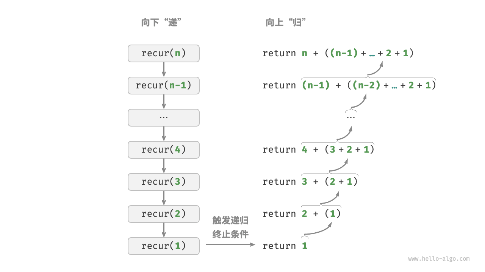

虽然从计算角度看，迭代与递归可以得到相同的结果，但它们代表了两种完全不同的思考和解决问题的范式。

-   **迭代**：“自下而上”地解决问题。从最基础的步骤开始，然后不断重复或累加这些步骤，直到任务完成。
-   **递归**：“自上而下”地解决问题。将原问题分解为更小的子问题，这些子问题和原问题具有相同的形式。接下来将子问题继续分解为更小的子问题，直到基本情况时停止（基本情况的解是已知的）。

以上述两种求和函数为例，设问题 $f(x)=1 + 2 + ··· + n$ 。

-   **迭代**：在循环中模拟求和过程，从 $1$ 遍历到 $n$ ，每轮执行求和操作，即可求得$f(n)$。
-   **递归**：将问题分解为子问题$f(n)=n+f(n-1)$，不断（递归地）分解下去，直至基本情况$f(1)=1$时终止。

### 2.2.1 调用栈

递归函数每次调用自身时，系统都会为新开启的函数分配内存，以存储局部变量、调用地址和其他信息等。这将导致两方面的结果。

-   函数的上下文数据都存储在称为“栈帧空间”的内存区域中，直至函数返回后才会被释放。因此，**递归通常比迭代更加耗费内存空间**。
-   递归调用函数会产生额外的开销。因此**递归通常比循环的时间效率更低**。

在触发终止条件前，同时存在$n$个未返回的递归函数，递归深度为$n$。
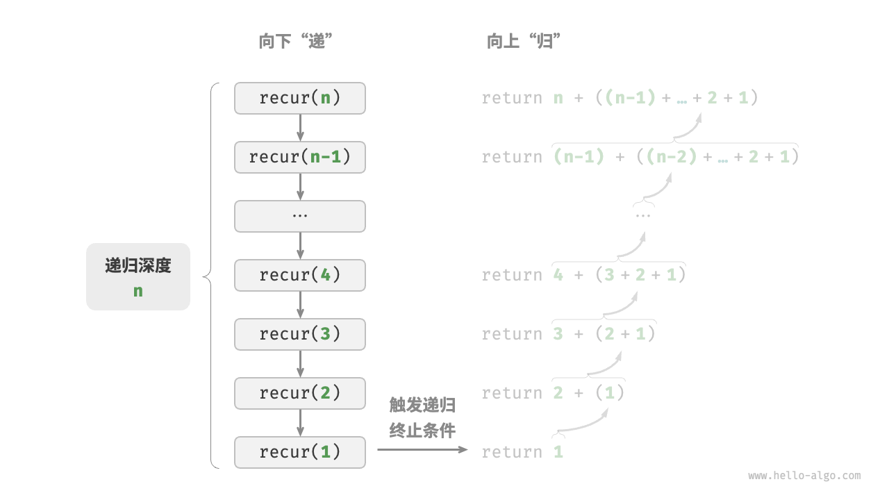
在实际中，编程语言允许的递归深度通常是有限的，过深的递归可能导致栈溢出错误。

### 2.2.2 尾递归

如果**函数在返回前的最后一步才进行递归调用**，则该函数可以被编译器或解释器优化，使其在空间效率上与迭代相当。这种情况被称为尾递归（tail recursion）。

-   **普通递归**：当函数返回到上一层级的函数后，需要继续执行代码，因此系统需要保存上一层调用的上下文。
-   **尾递归**：递归调用是函数返回前的最后一个操作，这意味着函数返回到上一层级后，无须继续执行其他操作，因此系统无须保存上一层函数的上下文。

```C++
/* 尾递归 */
int tailRecur(int n, int res) {
    // 终止条件
    if (n == 0)
        return res;
    // 尾递归调用
    return tailRecur(n - 1, res + n);
}
```

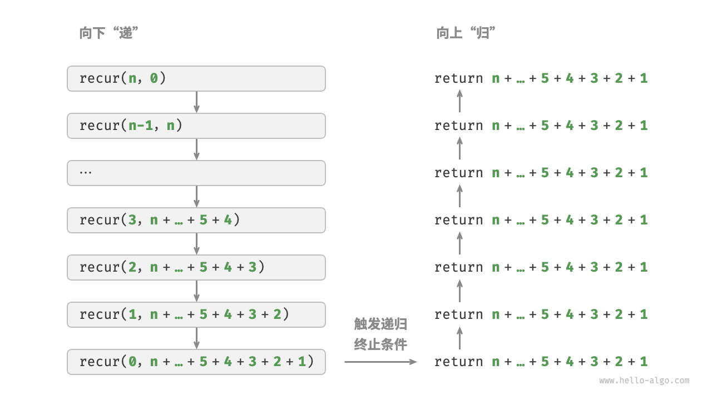

_请注意，许多编译器或解释器并不支持尾递归优化。例如，Python 默认不支持尾递归优化，因此即使函数是尾递归形式，仍然可能会遇到栈溢出问题。_

### 2.2.3 递归树

当处理与“分治”相关的算法问题时，递归往往比迭代的思路更加直观、代码更加易读。以“斐波那契数列”为例。

_给定一个斐波那契数列 $0,1,1,2,3,5,8,13,...，$ 求该数列的第 $n$个数字。_

设斐波那契数列的第 $n$ 个数字为 $f(n)$ ，易得两个结论。

-   数列的前两个数字为 $f(1)=0$ 和 $f(2)=1$ 。
-   数列中的每个数字是前两个数字的和，即 $f(n)=f(n-1)+f(n-2)$ 。

```C++
/* 斐波那契数列：递归 */
int fib(int n) {
    // 终止条件 f(1) = 0, f(2) = 1
    if (n == 1 || n == 2)
        return n - 1;
    // 递归调用 f(n) = f(n-1) + f(n-2)
    int res = fib(n - 1) + fib(n - 2);
    // 返回结果 f(n)
    return res;
}
```

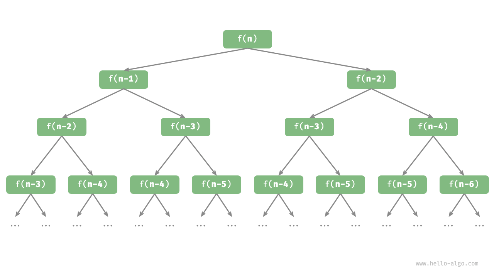

从本质上看，递归体现了“将问题分解为更小子问题”的思维范式，这种分治策略至关重要。

## 2.3 两者对比

|          | 递归                                   | 迭代                                                         |
| -------- | -------------------------------------- | ------------------------------------------------------------ |
| 实现方式 | 循环结构                               | 函数调用自身                                                 |
| 时间效率 | 效率通常较高，无函数调用开销           | 每次函数调用都会产生开销                                     |
| 内存使用 | 通常使用固定大小的内存空间             | 累积函数调用可能使用大量的栈帧空间                           |
| 适用问题 | 适用于简单循环任务，代码直观、可读性好 | 适用于子问题分解，如树、图、分治、回溯等，代码结构简洁、清晰 |

事实上，“调用栈”和“栈帧空间”这类递归术语已经暗示了递归与栈之间的密切关系。

-   递：当函数被调用时，系统会在“调用栈”上为该函数分配新的栈帧，用于存储函数的局部变量、参数、返回地址等数据。
-   归：当函数完成执行并返回时，对应的栈帧会被从“调用栈”上移除，恢复之前函数的执行环境。

```C++
/* 使用迭代模拟递归 */
int forLoopRecur(int n) {
    // 使用一个显式的栈来模拟系统调用栈
    stack<int> stack;
    int res = 0;
    // 递：递归调用
    for (int i = n; i > 0; i--) {
        // 通过“入栈操作”模拟“递”
        stack.push(i);
    }
    // 归：返回结果
    while (!stack.empty()) {
        // 通过“出栈操作”模拟“归”
        res += stack.top();
        stack.pop();
    }
    // res = 1+2+3+...+n
    return res;
}
```

# 3. 时间复杂度

## 3.1 统计时间增长趋势

时间复杂度分析统计的不是算法运行时间，而是**算法运行时间随着数据量变大时的增长趋势**。

例如：

```C++
// 算法 A 的时间复杂度：常数阶
void algorithm_A(int n) {
    cout << 0 << endl;
}
// 算法 B 的时间复杂度：线性阶
void algorithm_B(int n) {
    for (int i = 0; i < n; i++) {
        cout << 0 << endl;
    }
}
// 算法 C 的时间复杂度：常数阶
void algorithm_C(int n) {
    for (int i = 0; i < 1000000; i++) {
        cout << 0 << endl;
    }
}
```

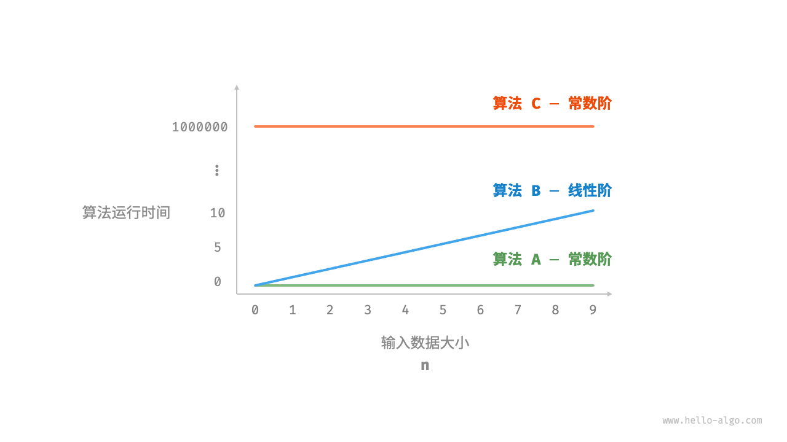

相较于直接统计算法的运行时间，时间复杂度分析有以下特点：

-   **时间复杂度能够有效评估算法效率**：例如，算法 B 的运行时间呈线性增长，在 $n>1$ 时比算法 A 更慢，在 $n>1000000$ 时比算法 C 更慢。事实上，只要输入数据大小 $n$ 足够大，复杂度为“常数阶”的算法一定优于“线性阶”的算法，这正是时间增长趋势的含义。
-   **时间复杂度的推算方法更简便**：在时间复杂度分析中，我们可以简单地将所有计算操作的执行时间视为相同的“单位时间”，从而将“时间统计”简化为“数量统计”，这样一来估算难度就大大降低了。
-   **时间复杂度也存在一定的局限性**：例如，尽管算法 A 和 C 的时间复杂度相同，但实际运行时间差别很大。同样，尽管算法 B 的时间复杂度比 C 高，但在输入数据大小 $n$ 较小时，算法 B 明显优于算法 C 。对于此类情况，我们时常难以仅凭时间复杂度判断算法效率的高低。

## 3.2 函数渐近上界

给定一个输入大小为 $n$ 的函数：

```C++
void algorithm(int n) {
    int a = 1;  // +1
    a = a + 1;  // +1
    a = a * 2;  // +1
    // 循环 n 次
    for (int i = 0; i < n; i++) { // +1（每轮都执行 i ++）
        cout << 0 << endl;    // +1
    }
}
```

设算法的操作数量是一个关于输入数据大小 $n$ 的函数，记为 $T(n)$ ，则以上函数的操作数量为：$$T(n)=3+2n$$

$T(n)$ 是一次函数，运行时间的增长趋势是线性的，因此它的时间复杂度是线性阶。

我们将线性阶的时间复杂度记为 $O(n)$ ，这个数学符号称为大 $O$ 记号（big-$O$notation），表示函数 $T(n)$ 的渐近上界（asymptotic upper bound）。

时间复杂度分析本质上是计算“操作数量 $T(n)$ 的渐近上界，它具有明确的数学定义。

**函数渐近上界**：若存在正实数 $c$ 和实数 $n_0$ ,使得对于所有的 $n>n_0$ ，均有 $T(n) \leq c \times f(n)$ ,则可认为 $f(n)$ 给出了 $T(n)$ 的一个渐进上界，记为 $T(n)=O(f(n))$ 。

计算渐近上界就是寻找一个函数 $f(n)$ ，使得当 $n$ 趋向于无穷大时，$T(n)$ 和 $f(n)$ 处于相同的增长级别，仅相差一个常数项 $c$ 的倍数。
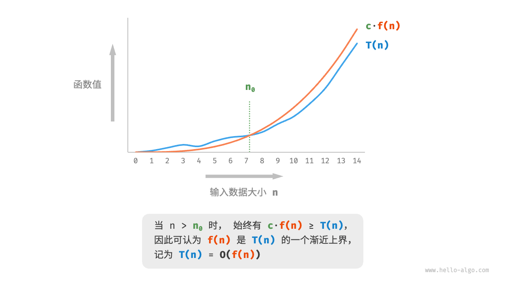

## 3.3 推算方法

**1. 统计操作数量**

针对代码，逐行从上到下计算即可。然而，由于上述 $c \times f(n)$ 中的常数项 $c$ 可以取任意大小，因此操作数量 $T(n)$ 中的各种系数、常数项都可以忽略。根据此原则，可以总结出以下计数简化技巧：

-   忽略 $T(n)$ 中的常数项。因为它们都与 $n$ 无关，所以对时间复杂度不产生影响。
-   省略所有系数。例如，循环 $2n$ 次、$5n+1$ 次等，都可以简化记为 $n$ 次，因为 $n$ 前面的系数对时间复杂度没有影响。
-   循环嵌套时使用乘法。总操作数量等于外层循环和内层循环操作数量之积，每一层循环依然可以分别套用第 1. 点和第 2. 点的技巧。

例如：

```C++
void algorithm(int n) {
    int a = 1;  // +0（技巧 1）
    a = a + n;  // +0（技巧 1）
    // +n（技巧 2）
    for (int i = 0; i < 5 * n + 1; i++) {
        cout << 0 << endl;
    }
    // +n*n（技巧 3）
    for (int i = 0; i < 2 * n; i++) {
        for (int j = 0; j < n + 1; j++) {
            cout << 0 << endl;
        }
    }
}
```

时间复杂度为 $T(n)=n^2+n$ 。

**2. 判断渐近上界**

时间复杂度由 $T(n)$ 中最高阶的项来决定。这是因为在 $n$ 趋于无穷大时，最高阶的项将发挥主导作用，其他项的影响都可以忽略。

| 操作数量 $T(n)$    | 时间复杂度 $O(f(n))$ |
| ------------------ | -------------------- |
| $10000$            | $O(1)$               |
| $3n+1$             | $O(n)$               |
| $2n^2+3n+2$        | $O(n^2)$             |
| $n^3+10000n^2$     | $O(n^3)$             |
| $2^n+10000n^10000$ | $O(2^n)$             |

## 3.4 常见类型

设输入数据大小为 $n$ ，常见的时间复杂度类型如图所示（按照从低到高的顺序排列）:

$$
O(1)<O(log_n)<O(n)<O(nlog_n)<O(n^2)<O(2^n)<O(n!)
$$

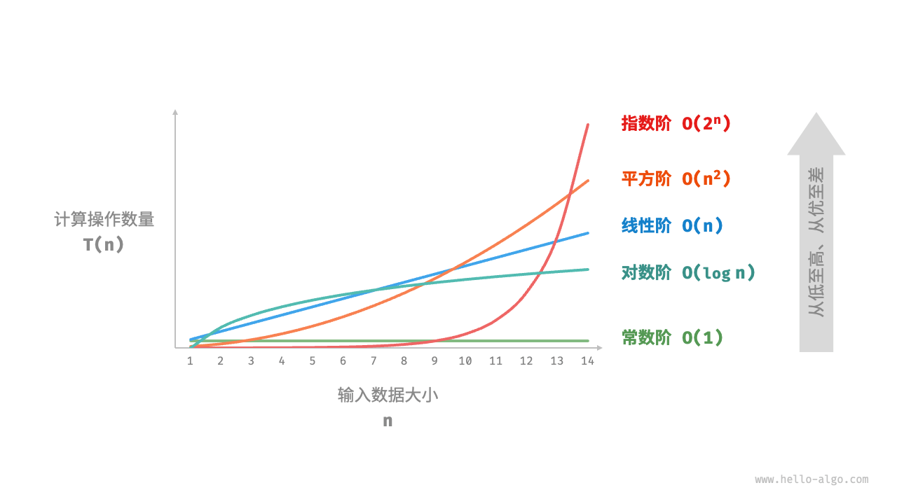

1. 常数阶 $O(1)$

数阶的操作数量与输入数据大小 $N$ 无关，即不随着 $n$ 的变化而变化。

```C++
/* 常数阶 */
int constant(int n) {
    int count = 0;
    int size = 100000;
    for (int i = 0; i < size; i++)
        count++;
    return count;
}
```

2. 对数阶 $O(log_n)$

与指数阶相反，对数阶反映了“每轮缩减到一半”的情况。设输入数据大小为 $n$ ，由于每轮缩减到一半，因此循环次数是 $log_2^n$ ，即 $2^n$ 的反函数。

```C++
/* 对数阶（循环实现） */
int logarithmic(int n) {
    int count = 0;
    while (n > 1) {
        n = n / 2;
        count++;
    }
    return count;
}
```

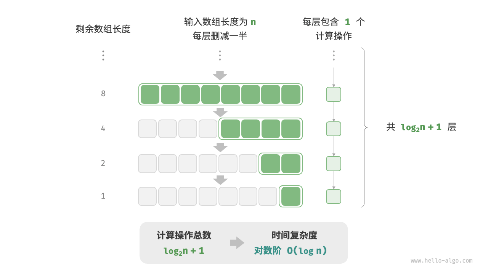

与指数阶类似，对数阶也常出现于递归函数中。以下代码形成了一棵高度为 $log_2^n$ 的递归树：

```C++
/* 对数阶（递归实现） */
int logRecur(int n) {
    if (n <= 1)
        return 0;
    return logRecur(n / 2) + 1;
}
```

3. 线性阶 $O(n)$

线性阶的操作数量相对于输入数据大小 $n$ 以线性级别增长。线性阶通常出现在单层循环中：

```C++
/* 线性阶 */
int linear(int n) {
    int count = 0;
    for (int i = 0; i < n; i++)
        count++;
    return count;
}
```

遍历数组和遍历链表等操作的时间复杂度均为 $n$ ，其中 $n$ 为数组或链表的长度：

```C++
/* 线性阶（遍历数组） */
int arrayTraversal(vector<int> &nums) {
    int count = 0;
    // 循环次数与数组长度成正比
    for (int num : nums) {
        count++;
    }
    return count;
}
```

4. 线性对数阶 $O(nlog_n)$

线性对数阶常出现于嵌套循环中，两层循环的时间复杂度分别为 $O(log_n)$ 和 $O(n)$ 。相关代码如下：

```C++
/* 线性对数阶 */
int linearLogRecur(int n) {
    if (n <= 1)
        return 1;
    int count = linearLogRecur(n / 2) + linearLogRecur(n / 2);
    for (int i = 0; i < n; i++) {
        count++;
    }
    return count;
}
```

二叉树的每一层的操作总数都为 $n$ ，树共有 $log_2^n+1$层，因此时间复杂度为 $O(nlog_n)$

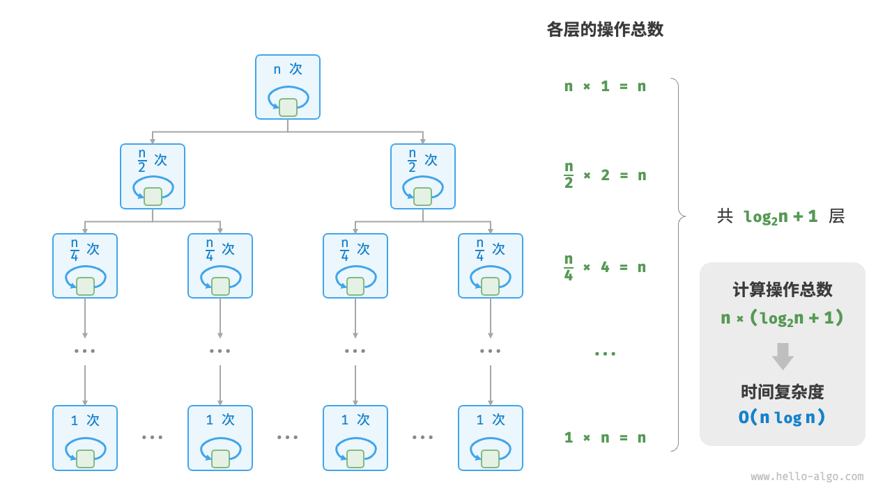

流排序算法的时间复杂度通常为 $O(nlog_n)$ ，例如快速排序、归并排序、堆排序等。

5. 平方阶 $O(n^2)$

平方阶通常出现在嵌套循环中，外层循环和内层循环的时间复杂度都为 $O(n)$ ，因此总体的时间复杂度为 $O(n^2)$ ：

```C++
/* 平方阶 */
int quadratic(int n) {
    int count = 0;
    // 循环次数与数据大小 n 成平方关系
    for (int i = 0; i < n; i++) {
        for (int j = 0; j < n; j++) {
            count++;
        }
    }
    return count;
}
```

对比常数阶、线性阶和平方阶三种时间复杂度：

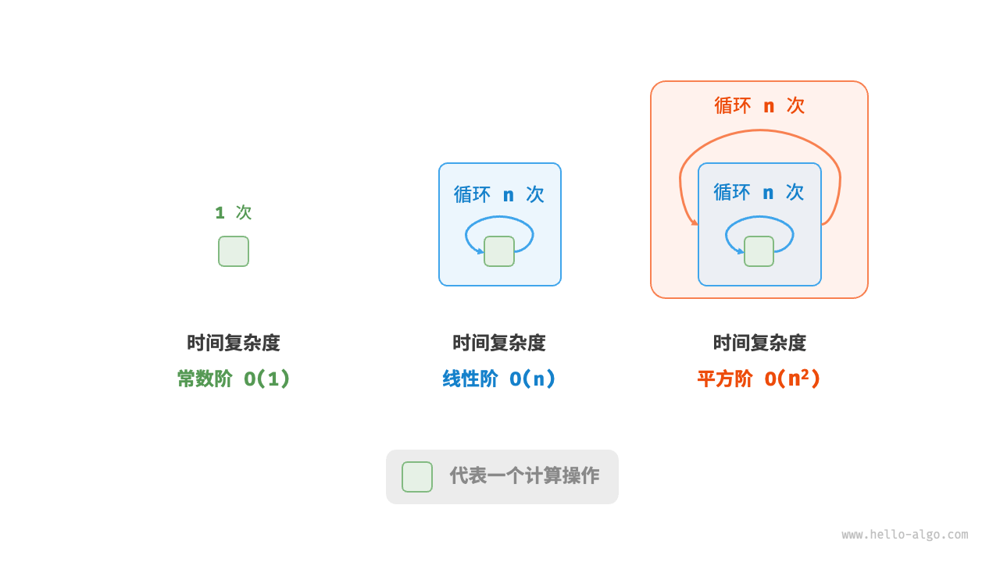

以冒泡排序为例，外层循环执行 $n-1$ 次，内层循环执行 $n-1$ 、 $n-2$ 、... 、2、1 次，平均为 $n/2$ 次，因此时间复杂度为 $O((n-1)n/2)=O(n^2)$ ：

```C++
/* 平方阶（冒泡排序） */
int bubbleSort(vector<int> &nums) {
    int count = 0; // 计数器
    // 外循环：未排序区间为 [0, i]
    for (int i = nums.size() - 1; i > 0; i--) {
        // 内循环：将未排序区间 [0, i] 中的最大元素交换至该区间的最右端
        for (int j = 0; j < i; j++) {
            if (nums[j] > nums[j + 1]) {
                // 交换 nums[j] 与 nums[j + 1]
                int tmp = nums[j];
                nums[j] = nums[j + 1];
                nums[j + 1] = tmp;
                count += 3; // 元素交换包含 3 个单元操作
            }
        }
    }
    return count;
}
```

6. 指数阶 $(2^n)$

以下代码模拟了细胞分裂的过程，时间复杂度为 $O(2^n)$ ：

```C++
/* 指数阶（循环实现） */
int exponential(int n) {
    int count = 0, base = 1;
    // 细胞每轮一分为二，形成数列 1, 2, 4, 8, ..., 2^(n-1)
    for (int i = 0; i < n; i++) {
        for (int j = 0; j < base; j++) {
            count++;
        }
        base *= 2;
    }
    // count = 1 + 2 + 4 + 8 + .. + 2^(n-1) = 2^n - 1
    return count;
}
```

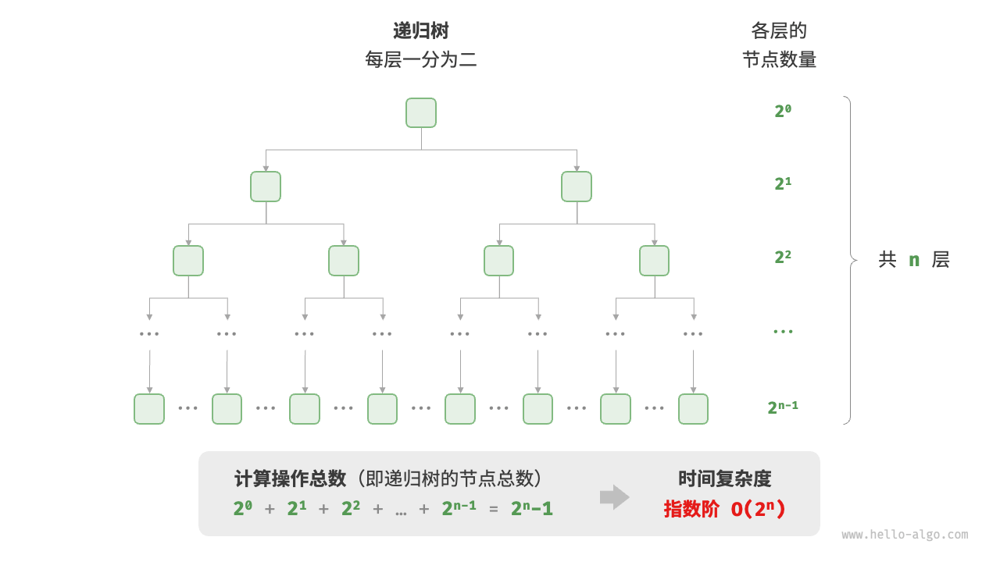

在实际算法中，指数阶常出现于递归函数中。例如在以下代码中，其递归地一分为二，经过 $n$ 次分裂后停止：

```C++
/* 指数阶（递归实现） */
int expRecur(int n) {
    if (n == 1)
        return 1;
    return expRecur(n - 1) + expRecur(n - 1) + 1;
}
```

7. 阶乘阶 $O(n!)$

阶乘阶对应数学上的“全排列”问题。给定 $n$ 个互不重复的元素，求其所有可能的排列方案，方案数量为：

$$
n!=n \times (n-1) \times (n-2) \times ··· \times 2 \times 1
$$

如以下代码所示，第一层分裂出 $n$ 个，第二层分裂出 $n-1$ 个，以此类推，直至第 $n$ 层时停止分裂：

```C++
/* 阶乘阶（递归实现） */
// 1.
int factorialRecur(int n) {
    if (n == 0)
        return 1;
    return n * factorialRecur(n - 1);
}
// 2.
int factorialRecur(int n) {
    if (n == 0)
        return 1;
    int count = 0;
    // 从 1 个分裂出 n 个
    for (int i = 0; i < n; i++) {
        count += factorialRecur(n - 1);
    }
    return count;
}
// 当 n == 0 时，函数返回 1。
// 当 n == 1 时，factorialRecur(1) 将循环一次，调用 factorialRecur(0)，这将返回 1，所以 factorialRecur(1) 返回 1。
// 当 n == 2 时，factorialRecur(2) 将循环两次，每次调用 factorialRecur(1)，这将每次返回 1，所以 factorialRecur(2) 返回 2。
// 当 n == 3 时，factorialRecur(3) 将循环三次，每次调用 factorialRecur(2)，这将每次返回 2，所以 factorialRecur(3) 返回 6。
// ...
```

## 3.5 最差、最佳、平均时间复杂度

算法的时间效率往往不是固定的，而是与输入数据的分布有关。假设输入一个长度为 $n$ 的数组 `nums` ，其中 `nums` 由从
$1$ 至 $n$ 的数字组成，每个数字只出现一次；但元素顺序是随机打乱的，任务目标是返回元素 $1$ 的索引。我们可以得出以下结论：

-   当 `nums = [?, ?, ..., 1]` ，即当末尾元素是 $1$ 时，需要完整遍历数组，达到最差时间复杂度 $O(n)$ 。
-   当 `nums = [1, ?, ?, ...]` ，即当首个元素为 $1$ 时，无论数组多长都不需要继续遍历，达到最佳时间复杂度 $O(1)$ 。

“最差时间复杂度”对应函数渐近上界，使用大 $O$ 记号表示。相应地，“最佳时间复杂度”对应函数渐近下界，用 $\Omega$ 记号表示：

```C++
/* 生成一个数组，元素为 { 1, 2, ..., n }，顺序被打乱 */
vector<int> randomNumbers(int n) {
    vector<int> nums(n);
    // 生成数组 nums = { 1, 2, 3, ..., n }
    for (int i = 0; i < n; i++) {
        nums[i] = i + 1;
    }
    // 使用系统时间生成随机种子
    unsigned seed = chrono::system_clock::now().time_since_epoch().count();
    // 随机打乱数组元素
    shuffle(nums.begin(), nums.end(), default_random_engine(seed));
    return nums;
}

/* 查找数组 nums 中数字 1 所在索引 */
int findOne(vector<int> &nums) {
    for (int i = 0; i < nums.size(); i++) {
        // 当元素 1 在数组头部时，达到最佳时间复杂度 O(1)
        // 当元素 1 在数组尾部时，达到最差时间复杂度 O(n)
        if (nums[i] == 1)
            return i;
    }
    return -1;
}
```

平均时间复杂度可以更好体现算法在随机输入数据下的运行效率，用 $\Theta$ 记号来表示。

对于部分算法，例如上述算法元素 $1$ 出现在任意索引的概率都是相等的,所以平均时间复杂度为 $ \Theta (m/2)= \Theta (n)$ 。但对于较为复杂的算法，计算平均时间复杂度往往比较困难，因为很难分析出在数据分布下的整体数学期望。在这种情况下，我们通常使用最差时间复杂度作为算法效率的评判标准。

# 4. 空间复杂度

## 4.1 算法相关空间

算法在运行过程中使用的内存空间主要包括以下几种：

-   **输入空间**：用于存储算法的输入数据。
-   **暂存空间**：用于存储算法在运行过程中的变量、对象、函数上下文等数据。
-   **输出空间**：用于存储算法的输出数据。

一般情况下，空间复杂度的统计范围是“暂存空间”加上“输出空间”，暂存空间可以进一步划分为三个部分：

1. **暂存数据**：用于保存算法运行过程中的各种常量、变量、对象等。
2. **栈帧空间**：用于保存调用函数的上下文数据。系统在每次调用函数时都会在栈顶部创建一个栈帧，函数返回后，栈帧空间会被释放。
3. **指令空间**：用于保存编译后的程序指令，在实际统计中通常忽略不计。

在分析一段程序的空间复杂度时，我们通常统计暂存数据、栈帧空间和输出数据三部分，如图 2-15 所示。

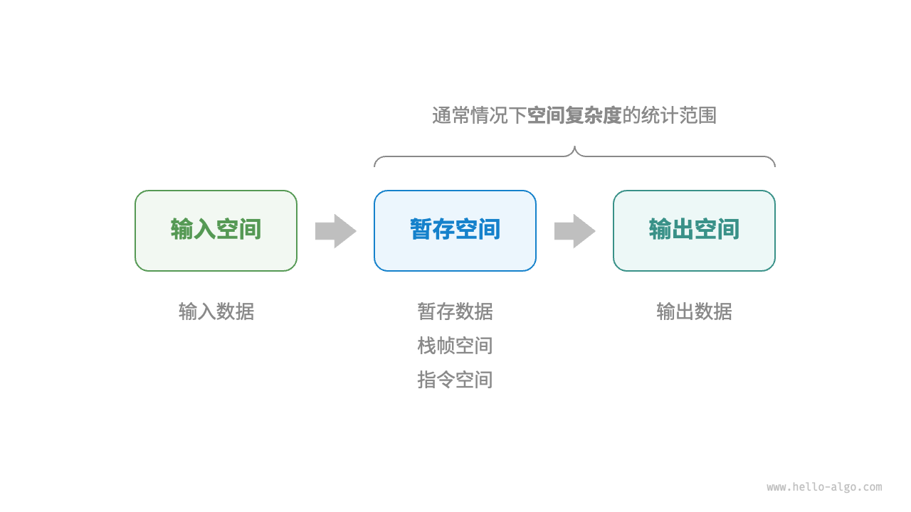

```C++
/* 结构体 */
struct Node {
    int val;
    Node *next;
    Node(int x) : val(x), next(nullptr) {}
};

/* 函数 */
int func() {
    // 执行某些操作...
    return 0;
}

int algorithm(int n) {        // 输入数据
    const int a = 0;          // 暂存数据（常量）
    int b = 0;                // 暂存数据（变量）
    Node* node = new Node(0); // 暂存数据（对象）
    int c = func();           // 栈帧空间（调用函数）
    return a + b + c;         // 输出数据
}
```

## 4.2 推算方法

而与时间复杂度不同的是，我们通常只关注最差空间复杂度。

最差空间复杂度中的“最差”有两层含义：

```C++
void algorithm(int n) {
    int a = 0;               // O(1)
    vector<int> b(10000);    // O(1)
    if (n > 10)
        vector<int> nums(n); // O(n)
}
```

1. 以最差输入数据为准：当 $n<10$ 时，空间复杂度为 $O(1)$ ；但当 $n>10$ 时，初始化的数组 `nums` 占用 $(n)$ 空间，因此最差空间复杂度为 $O(n)$ 。
2. 以算法运行中的峰值内存为准：例如，程序在执行最后一行之前，占用 $O(1)$ 空间；当初始化数组 `nums` 时，程序占用 $O(n)$ 空间，因此最差空间复杂度为 $O(n)$ 。

在递归函数中，需要注意统计栈帧空间。观察以下代码：

```C++
int func() {
    // 执行某些操作
    return 0;
}
/* 循环的空间复杂度为 O(1) */
void loop(int n) {
    for (int i = 0; i < n; i++) {
        func();
    }
}
/* 递归的空间复杂度为 O(n) */
void recur(int n) {
    if (n == 1) return;
    return recur(n - 1);
}
```

函数 `loop()` 和 `recur()` 的时间复杂度都为 $O(n)$ ，但空间复杂度不同。

-   函数 `loop()` 在循环中调用了 $n$ 次 `function()` ，每轮中的 `function()` 都返回并释放了栈帧空间，因此空间复杂度仍为 $O(1)$ 。
-   递归函数 `recur()` 在运行过程中会同时存在 $n$ 个未返回的 `recur()` ，从而占用 $O(n)$ 的栈帧空间。

## 4.3 常见类型

$$
O(1)<O(log_n)<O(n)<O(n^2)<O(2^n)
$$

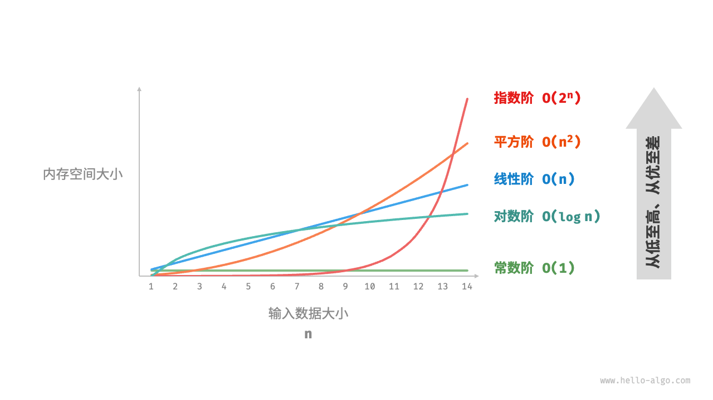

1. 常数阶 $O(1)$ ：常量、变量、对象。

需要注意的是，在循环中初始化变量或调用函数而占用的内存，在进入下一循环后就会被释放，因此不会累积占用空间，空间复杂度仍为 $O(1)$ ：

```C++
/* 函数 */
int func() {
    // 执行某些操作
    return 0;
}

/* 常数阶 */
void constant(int n) {
    // 常量、变量、对象占用 O(1) 空间
    const int a = 0;
    int b = 0;
    vector<int> nums(10000);
    ListNode node(0);
    // 循环中的变量占用 O(1) 空间
    for (int i = 0; i < n; i++) {
        int c = 0;
    }
    // 循环中的函数占用 O(1) 空间
    for (int i = 0; i < n; i++) {
        func();
    }
}
```

2. 线性阶 $O(n)$ ：数组、链表、栈、队列。

```C++
/* 线性阶 */
void linear(int n) {
    // 长度为 n 的数组占用 O(n) 空间
    vector<int> nums(n);
    // 长度为 n 的列表占用 O(n) 空间
    vector<ListNode> nodes;
    for (int i = 0; i < n; i++) {
        nodes.push_back(ListNode(i));
    }
    // 长度为 n 的哈希表占用 O(n) 空间
    unordered_map<int, string> map;
    for (int i = 0; i < n; i++) {
        map[i] = to_string(i);
    }
}
```

```C++
/* 线性阶（递归实现） */
void linearRecur(int n) {
    cout << "递归 n = " << n << endl;
    if (n == 1)
        return;
    linearRecur(n - 1);
}
```

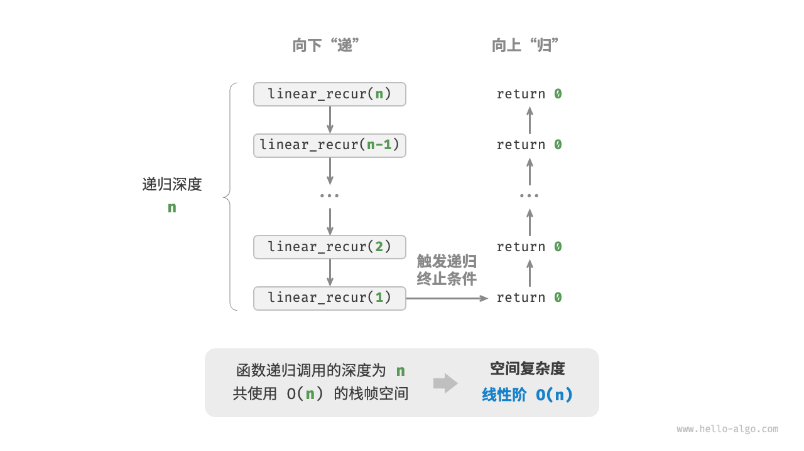

3. 平方阶 $O(n^2)$ ：矩阵和图

```C++
/* 平方阶 */
void quadratic(int n) {
    // 二维列表占用 O(n^2) 空间
    vector<vector<int>> numMatrix;
    for (int i = 0; i < n; i++) {
        vector<int> tmp;
        for (int j = 0; j < n; j++) {
            tmp.push_back(0);
        }
        numMatrix.push_back(tmp);
    }
}
```

如下列函数的递归深度为 $n$ ，在每个递归函数中都初始化了一个数组，长度分别为 $n、n-1、...2、1$ ,平均长度为 $n/2$ ，因此总体占用 $O(n^2)$ 空间：

```C++
/* 平方阶（递归实现） */
int quadraticRecur(int n) {
    if (n <= 0)
        return 0;
    vector<int> nums(n);
    cout << "递归 n = " << n << " 中的 nums 长度 = " << nums.size() << endl;
    return quadraticRecur(n - 1);
}
```

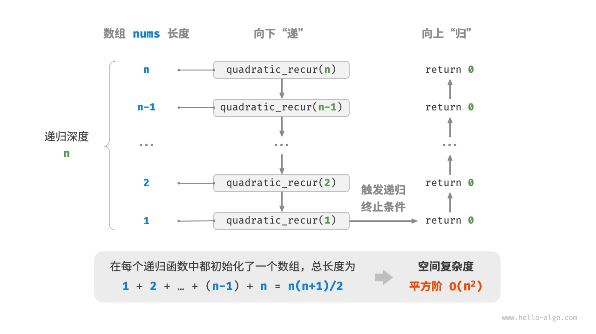

4. 指数阶 $O(2^n)$ ：二叉树

层数为 $n$ 的“满二叉树”的节点数量为 $2^n-1$ ，占用 $O(2^n)$ 空间：

```C++
/* 指数阶（建立满二叉树） */
TreeNode *buildTree(int n) {
    if (n == 0)
        return nullptr;
    TreeNode *root = new TreeNode(0);
    root->left = buildTree(n - 1);
    root->right = buildTree(n - 1);
    return root;
}
```

5. 对数阶 $O(log_n)$

对数阶常见于分治算法。例如归并排序，输入长度为 $n$ 的数组，每轮递归将数组从中点处划分为两半，形成高度为 $log_n$ 的递归树，使用 $O(log_n)$ 栈帧空间。

再例如将数字转化为字符串，输入一个正整数 $n$ ，它的位数为 $ \lfloor log*{10}^n \rfloor +1$ ,即对应字符串长度为 $ \lfloor log*{10}^n \rfloor +1$ ，因此空间复杂度为 $ \lfloor log\_{10}^n \rfloor +1=O(log_n)$ 。

## 4.4 权衡时间与空间

在实际情况中，同时优化时间复杂度和空间复杂度通常非常困难。在大多数情况下，时间比空间更宝贵，因此“以空间换时间”通常是更常用的策略。

主要参考文章：

-   [Hello 算法 复杂度分析](https://www.hello-algo.com/chapter_computational_complexity/performance_evaluation/#211)

