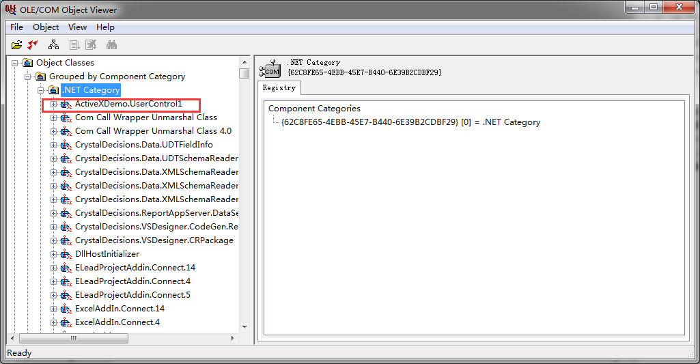

# C#制作ActiveX浏览器插件&OCX


_win11-VS2024 封装“win 应用程序”浏览器插件_

### 创建项目

vs 新建项目“Windows 窗体控件库”，注意项目名不要用中文。在 UserControl1.cs 中将之前的项目移过来。


### 设置项目属性

1. 右键项目->属性->应用程序->程序信息->勾选“使程序集 COM 可见”->点击“确定”。
   
   
2. 选择“生成”，拉倒最底部，->勾选“为 COM 互操作注册”。
   
3. 最后保存，重新编译。

### 安装外部软件

#### OLE/COM 对象查看器

这款工具用于验证项目成为是否成为一个 ActiveX 控件。

1.  顶部菜单栏“工具”->“外部工具”
    
2.  然后，添加一个“OLE/COM 对象查看器”，对应的命令程序一般放在 `C:\Program Files\Microsoft SDKs\Windows\v6.0A\Bin\OleView.Exe` 或 `C:\Program Files (x86)\Microsoft SDKs\Windows\v7.0A\bin\OleView.Exe`。

    如果都没有可以尝试查找和下载旧版本的 Windows SDK。访问 Microsoft 下载中心：[https://developer.microsoft.com/zh-cn/windows/downloads/sdk-archive/](https://developer.microsoft.com/zh-cn/windows/downloads/sdk-archive/)

    

3.  “应用”->“确认”。
4.  点击新创建的“OLM/COM 对象查看器”，展开左侧的“.NET Category”，就可以找到刚刚创建的 ActiveX 控件。
    
    

#### 创建 GUID

方法同上，地址一般是`C:\Program Files (x86)\Microsoft Visual Studio 9.0\Common7\Tools\guidgen.exe`或者`C:\Program Files\Microsoft Visual Studio\2022\Community\Common7\Tools\guidgen.exe`。

### 提高 ActiveX 插件的安全等级

**IE 通过两个方法判断脚本是否安全：**

1. 询 ActiveX 组件是否实现了`IObjectSafety`接口，并且返回脚本安全；
2. 查询 ActiveX 组件是否在注册表的 Component Category Manager 里表明自己实现了 CATID_SafeForInitializing 和 CATID_SafeForScripting。

第一种方法：实现`IObjectSafety`接口

-   首先，为控件类`UserControl1`添加一个 GUID，这个编号将用于 B/S 系统的客户端调用时使用（可以使用"工具"->"创建 GUID 菜单"创建一个 GUID），注意`ActiveXDemo.UserControl1`换成自己的命名。

```c#
using System;
using System.Collections.Generic;
using System.Text;
using System.Windows.Forms;
using System.Runtime.InteropServices;

namespace ActiveXDemo
{
    [Guid("BB725724-65D6-4e71-AA11-DEDFAFE9248F"), ProgId("ActiveXDemo.UserControl1"), ComVisible(true)]
    public partial class UserControl1 : UserControl,IObjectSafety
    {
```

-   其次，为了让 ActiveX 控件获得客户端的信任，控件类还需要实现一个名为`IObjectSafety`的接口，因此在项目中添加一个接口类`IObjectSafety`
    直接将下列代码复制粘贴，不要作任何改动，尤其是 GUID，都是固定的，不能改。

```c#
using System;
using System.Collections.Generic;
using System.Linq;
using System.Text;
using System.Runtime.InteropServices; //同样，需要引入System.Runtime.InteropServices;命名空间

namespace ActiveXDemo
{
    [ComImport, GuidAttribute("CB5BDC81-93C1-11CF-8F20-00805F2CD064")]
    [InterfaceTypeAttribute(ComInterfaceType.InterfaceIsIUnknown)]
    public interface IObjectSafety
    {
        [PreserveSig]
        int GetInterfaceSafetyOptions(ref Guid riid, [MarshalAs(UnmanagedType.U4)] ref int pdwSupportedOptions, [MarshalAs(UnmanagedType.U4)] ref int pdwEnabledOptions);

        [PreserveSig()]
        int SetInterfaceSafetyOptions(ref Guid riid, [MarshalAs(UnmanagedType.U4)] int dwOptionSetMask, [MarshalAs(UnmanagedType.U4)] int dwEnabledOptions);
    }
}
```

-   接着，在控件类`UserControl1`中实现`IObjectSafety`的接口

```c#
#region IObjectSafety 成员

        private const string _IID_IDispatch = "{00020400-0000-0000-C000-000000000046}";
        private const string _IID_IDispatchEx = "{a6ef9860-c720-11d0-9337-00a0c90dcaa9}";
        private const string _IID_IPersistStorage = "{0000010A-0000-0000-C000-000000000046}";
        private const string _IID_IPersistStream = "{00000109-0000-0000-C000-000000000046}";
        private const string _IID_IPersistPropertyBag = "{37D84F60-42CB-11CE-8135-00AA004BB851}";

        private const int INTERFACESAFE_FOR_UNTRUSTED_CALLER = 0x00000001;
        private const int INTERFACESAFE_FOR_UNTRUSTED_DATA = 0x00000002;
        private const int S_OK = 0;
        private const int E_FAIL = unchecked((int)0x80004005);
        private const int E_NOINTERFACE = unchecked((int)0x80004002);

        private bool _fSafeForScripting = true;
        private bool _fSafeForInitializing = true;

        public int GetInterfaceSafetyOptions(ref Guid riid, ref int pdwSupportedOptions, ref int pdwEnabledOptions)
        {
            int Rslt = E_FAIL;

            string strGUID = riid.ToString("B");
            pdwSupportedOptions = INTERFACESAFE_FOR_UNTRUSTED_CALLER | INTERFACESAFE_FOR_UNTRUSTED_DATA;
            switch (strGUID)
            {
                case _IID_IDispatch:
                case _IID_IDispatchEx:
                    Rslt = S_OK;
                    pdwEnabledOptions = 0;
                    if (_fSafeForScripting == true)
                        pdwEnabledOptions = INTERFACESAFE_FOR_UNTRUSTED_CALLER;
                    break;
                case _IID_IPersistStorage:
                case _IID_IPersistStream:
                case _IID_IPersistPropertyBag:
                    Rslt = S_OK;
                    pdwEnabledOptions = 0;
                    if (_fSafeForInitializing == true)
                        pdwEnabledOptions = INTERFACESAFE_FOR_UNTRUSTED_DATA;
                    break;
                default:
                    Rslt = E_NOINTERFACE;
                    break;
            }

            return Rslt;
        }

        public int SetInterfaceSafetyOptions(ref Guid riid, int dwOptionSetMask, int dwEnabledOptions)
        {
            int Rslt = E_FAIL;
            string strGUID = riid.ToString("B");
            switch (strGUID)
            {
                case _IID_IDispatch:
                case _IID_IDispatchEx:
                    if (((dwEnabledOptions & dwOptionSetMask) == INTERFACESAFE_FOR_UNTRUSTED_CALLER) && (_fSafeForScripting == true))
                        Rslt = S_OK;
                    break;
                case _IID_IPersistStorage:
                case _IID_IPersistStream:
                case _IID_IPersistPropertyBag:
                    if (((dwEnabledOptions & dwOptionSetMask) == INTERFACESAFE_FOR_UNTRUSTED_DATA) && (_fSafeForInitializing == true))
                        Rslt = S_OK;
                    break;
                default:
                    Rslt = E_NOINTERFACE;
                    break;
            }

            return Rslt;
        }

        #endregion
```

### 制作成安装文件

#### 安装扩展

1. **安装 Microsoft Visual Studio Installer Projects 扩展：**

    - 打开 Visual Studio 2022。
    - 转到“扩展”菜单，然后选择“管理扩展”。
    - 在“联机”选项卡中搜索“Microsoft Visual Studio Installer Projects”。
    - 点击“安装”将安装扩展。
    - 重新启动 Visual Studio 以完成安装。

#### 创建安装项目

1.  **创建新的安装项目：**

    -   打开你的解决方案。
    -   在“解决方案资源管理器”中右键点击解决方案，选择“添加” -> “新建项目”。
        
    -   在“新建项目”对话框中，搜索并选择“安装项目(Setup Project)”，然后点击“下一步”。
        
    -   给你的安装项目命名并点击“创建”。

2.  **添加项目输出：**

    -   在“解决方案资源管理器”中，右键点击安装项目，选择“添加(add)” -> “项目输出”。
        
    -   选择你的主项目（例如 ActiveXDemo），然后选择“主输出”，点击“确定”。
        

3.  **设置 COM 注册：**

    -   右键点击“主输出文件”，选择“属性”。
        
    -   在属性窗口中，将“Register”属性设为“vsdrpCOM”。
        

#### 编译和生成 Setup Project

1.  **编译安装项目：**

    -   在“解决方案资源管理器”中，右键点击安装项目，选择“生成”。

2.  **运行安装程序**：

    -   在生成完成后，导航到输出目录（通常在解决方案的 Debug 或 Release 文件夹中）。
        找到生成的安装程序文件（例如 .msi/.exe 文件），运行它以安装你的 ActiveX 控件。

如果报错`ERROR: The target of shortcut 'Shortcut to %sApplication Folder' is invalid.  The 'AlwaysCreate' property of folder 'Application Folder' must be set to 'True'`,右键“主输出文件”->右键'Application Folder'->属性->将 'AlwaysCreate' 属性设置为 'True'。


### 使用 ActiveX 插件

新建一个 Web 项目或者一个 Html 文件，在需要使用浏览器插件的页面上加入以下代码：

```html
<html xmlns="http://www.w3.org/1999/xhtml">
    <head runat="server">
        <title>无标题页</title>
    </head>
    <body>
        <object
            id="csharpActiveX"
            classid="clsid:BB725724-65D6-4e71-AA11-DEDFAFE9248F"
            width="100%"
            height="150"
        ></object>

        <form id="form1" runat="server">
            <div>
                <input type="button" onclick="csharpActiveX.Test()" value="我是按钮" />
            </div>
        </form>
    </body>
    <script type="text/javascript">
        var objCard = document.getElementById("csharpActiveX");

        if (objCard.object == null) {
            alert("csharpActiveX插件未安装！");
        } else {
            alert("已检测到csharpActiveX插件！");
        }
    </script>
</html>
```

在 IE 浏览器中打开这个页面，查看效果

