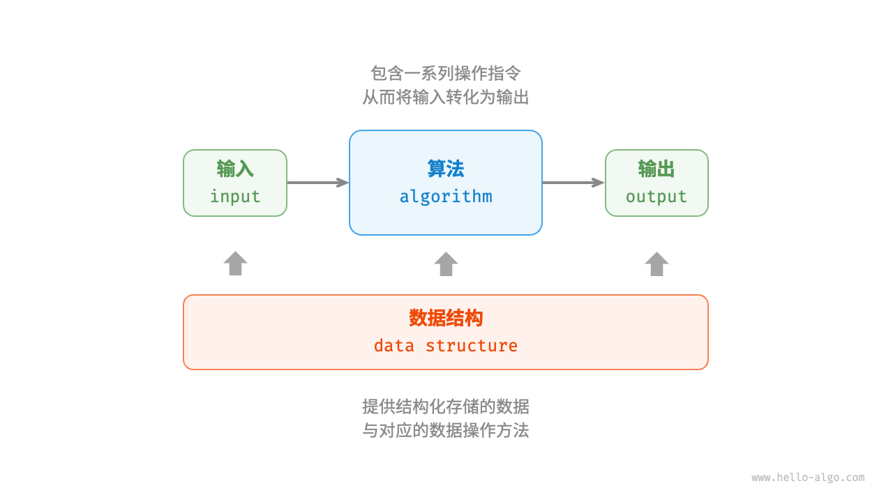

# 初识算法


# 算法定义

算法（algorithm）是在有限时间内解决特定问题的一组指令或操作步骤，它具有以下特性：

-   **输入输出**：具有零个（算法本身定出了初始条件）或多个输入，至少具有一个或多个输出，没有输出的算法是毫无意义的。
-   **有穷性**：算法必须能在执行有限个步骤之后终止。
-   **确定性**：算法的每一步都有确定的含义，不会出现二义性。即一个输入只有一个输出。

```C++
// 反面举例

// 示例 1：使用随机数
算法 RandomChoice(a, b):
如果 Random() > 0.5:
    返回 a + b
否则:
    返回 a - b

// 示例 2：依赖外部状态
全局变量 counter = 0

算法 IncrementalSum(a, b):
counter = counter + 1
如果 counter % 2 == 0:
    返回 a + b
否则:
    返回 a - b

// 示例 3：非确定性选择
算法 NonDeterministicSum(a, b):
    选择: A
        返回 a + b
    或者: B
        返回 a - b

```

-   **具有可行性**：能够在有限步骤、时间和内存空间下完成。

# 数据结构定义

数据结构（data structure）是组织和存储数据的方式，涵盖数据内容、数据之间关系和数据操作方法，它具有以下设计目标：

-   空间占用尽量少，以节省计算机内存。
-   数据操作尽可能快速，涵盖数据查、增、删、改等。
-   提供简洁的数据表示和逻辑信息，以便算法高效运行。

# 数据结构与算法的关系

数据结构与算法高度相关、紧密结合，具体表现在以下三个方面：

-   数据结构是算法的基石。数据结构为算法提供了结构化存储的数据，以及操作数据的方法。
-   算法是数据结构发挥作用的舞台。数据结构本身仅存储数据信息，结合算法才能解决特定问题。
-   算法通常可以基于不同的数据结构实现，但执行效率可能相差很大，选择合适的数据结构是关键。
    

主要参考文章：

-   [Hello 算法 1.2 算法是什么](https://www.hello-algo.com/chapter_introduction/)

