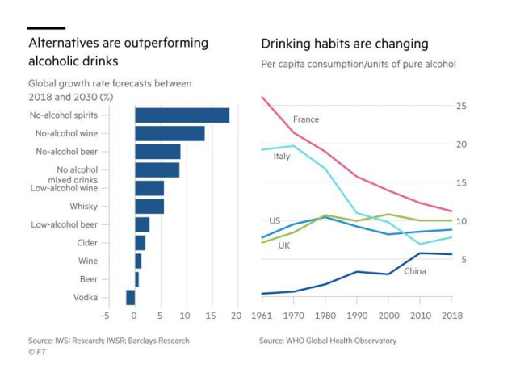

# Non-alcoholic drinks: the sober truth

## Non-alcoholic drinks: the sober truth

_Outperformance of traditional drinks during pandemic shows alt-alcohol market has solid
foundations_

No more cakes and ale. January is often a month for cutting calories and booze. But going on the wagon involves less self-denial than it used to. A wave of innovation is expanding choice beyond dreary fizzy drinks and juices.
The nolo — no and low alcohol — sector was growing at an annual rate of 8 per cent before the pandemic slammed on the brakes. Sales of beer variants stagnated in 2020, while those of spirits fell slightly, according to drinks analytics group IWSR. But both put in a sparkling performance compared with alcoholic drinks, which fell 8 per cent. 
That outperformance is expected to continue, in part because of increasing teetotalism, particularly among young people. The proportion of drinkers is expected by the World Health Organization to fall globally by 1.4 percentage points to 40.3 per cent in the five years to 2025. Production techniques that lead to better-tasting products are also a big driver.

Brewers have vastly improved their non-alcoholic offerings. The world’s third-largest brewer Carlsberg reckons that share of the beer market held by zero-alcohol ranges could triple to 15 per cent in western Europe in the next few years. They can expand the outlets and occasions where such brands can be sold. Dutch brewer Heineken reports far less cannibalisation of mainstream beer sales by its zero-alcohol product than its low-alcohol version launched in 2005.
Spirit and winemakers are experimenting too. France’s Pernod Ricard is expanding its nolo choices, along with Jacob’s Creek Better by Half wines and a partnership alcohol-free gin company called Ceder’s. Last year, the world’s largest spirits company Diageo bought majority control of Seedlip, maker of a gin alternative sold in many Michelin-starred restaurants. In January it also took a stake in Chicago-based Ritual Zero, which makes whiskey and gin alternatives.
Profitability is enhanced by lower or non-existent alcohol duties. These can account for up to 40 per cent of the cost of spirits. That said, such drinks’ high price tags — often as high as their alcoholic rivals — could be hard to sustain as competition intensifies.
Of the many new drinks being concocted, a lot will fail to win loyal fans. Some of the buzz around alt-alcohol may fade too. But, as with the rising popularity of meat substitutes, there is a solid foundation to this trend. Changing lifestyles mean non-alcoholic drinks are not just for January any more.

## 标题+导语

-   alcoholic 美/ˌælkəˈhɑːlɪk

    adj.
    酒精的，含酒精的；酒精中毒的，酗酒的；喝酒引起的，由酒精引起的

    n.
    酗酒者，酒鬼

-   sober 美/ˈsoʊbər

    adj.
    未喝醉的，清醒的；严肃的，冷静的；素淡的，朴素的

    v.
    （使）变得持重，变得冷静；（使）醒酒，（使）清醒

-   Outperformance 美/ˌaʊtpərˈfɔːrməns

    n.
    优胜；业绩出色

-   pandemic 美/pænˈdemɪk

    adj.
    （疾病）大规模流行的
    n.
    <正式>大流行病

-   foundations 美/faʊnˈdeɪʃnz

    n.
    基础（foundation 的复数）；房基

-   ale 美/eɪl

    n.
    麦芽啤酒；啤酒

-   calorie 美/ˈkæləriz

    n.
    卡路里

-   booze 美/buːz

    n.
    酒；酒宴
    vi.
    豪饮；痛饮
    n.
    (Booze)人名；(英)布兹

-   wagon 美/ˈwæɡən

    n.
    (一般由马拉的)四轮货车；<英>(无顶的)铁路货车车厢，车皮...
    v.
    用运货马车运输货物
    【名】

-   go on the wagon：戒酒

    尤其是指长期或永久性地戒酒。这个表达通常用来描述一个人决定戒酒或暂时不喝酒的行为。

    -   **例句：**
        "After years of heavy drinking, he decided to go on the wagon and hasn't touched alcohol since." （多年的酗酒之后，他决定戒酒，从那以后再也没有碰过酒。）
    -   **起源：**
        这个习语据说源于 19 世纪末或 20 世纪初，指的是人们为了表示自己戒酒的决心，会上“水车”（water wagon）——一个载有饮用水的马车，而不是上酒车。这是指他们选择喝水而不是酒。
        所以，"going on the wagon" 表示一个人决定戒酒，不再饮用含酒精的饮品。

-   involves 美/ɪnˈvɑːlvz

    v.
    包含；牵涉

-   denial 美/dɪˈnaɪəl

    n.
    否认；拒绝接受；拒不承认；剥夺；拒绝给予

